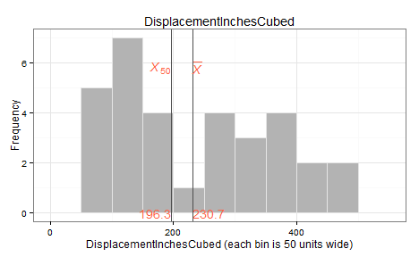
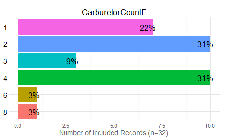
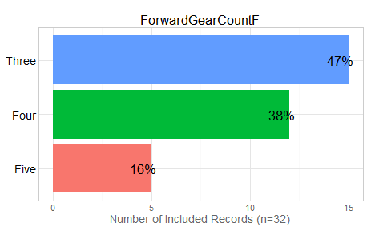
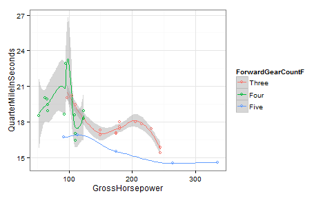
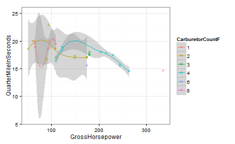
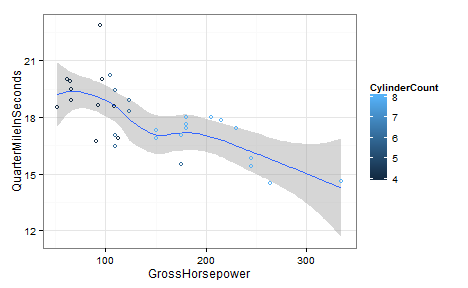
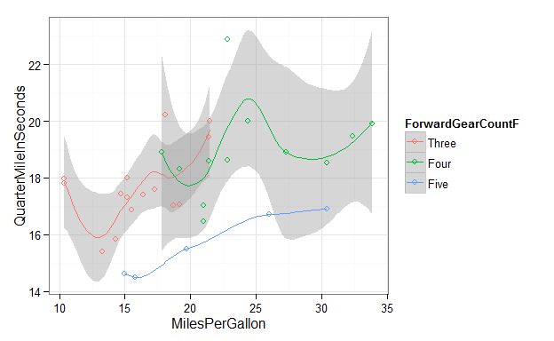
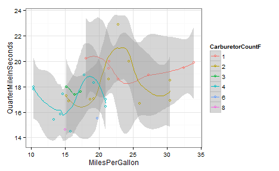
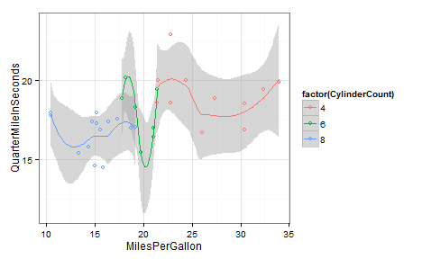

Skeleton Report 1
=================================================
This report covers the analyses used in the ZZZ project (Marcus Mark, PI).

<!--  Set the working directory to the repository's base directory; this assumes the report is nested inside of two directories.-->


<!-- Set the report-wide options, and point to the external code file. -->

<!-- Load the packages.  Suppress the output when loading packages. --> 


<!-- Load any Global functions and variables declared in the R file.  Suppress the output. --> 


<!-- Declare any global functions specific to a Rmd output.  Suppress the output. --> 


<!-- Load the datasets.   -->


<!-- Tweak the datasets.   -->


## Notes

**Note 1**: The current report covers 32 cars, with 6 possible values for `CarburetorCount`.

**Note 2**: The Seattle track's phluguerstometer was producing flaky negative values; it's measurements have been dropped.

# Marginals
    

# Scatterplots

```
Warning: span too small.   fewer data values than degrees of freedom.
Warning: pseudoinverse used at 89.78
Warning: neighborhood radius 85.22
Warning: reciprocal condition number  0
Warning: There are other near singularities as well. 25992
Warning: span too small.   fewer data values than degrees of freedom.
Warning: pseudoinverse used at 89.78
Warning: neighborhood radius 85.22
Warning: reciprocal condition number  0
Warning: There are other near singularities as well. 25992
```

   

```
Warning: pseudoinverse used at 104.65
Warning: neighborhood radius 18.35
Warning: reciprocal condition number  5.5839e-017
Warning: There are other near singularities as well. 4270.6
Warning: pseudoinverse used at 104.65
Warning: neighborhood radius 18.35
Warning: reciprocal condition number  5.5839e-017
Warning: There are other near singularities as well. 4270.6
```

 

```
Warning: span too small.   fewer data values than degrees of freedom.
Warning: pseudoinverse used at 14.923
Warning: neighborhood radius 4.777
Warning: reciprocal condition number  0
Warning: There are other near singularities as well. 116.14
Warning: Chernobyl! trL>n 5
Warning: Chernobyl! trL>n 5
Warning: NaNs produced
Warning: span too small.   fewer data values than degrees of freedom.
Warning: pseudoinverse used at 14.923
Warning: neighborhood radius 4.777
Warning: reciprocal condition number  0
Warning: There are other near singularities as well. 116.14
Warning: NaNs produced
```

 

```
Warning: span too small.   fewer data values than degrees of freedom.
Warning: pseudoinverse used at 15.189
Warning: neighborhood radius 1.2105
Warning: reciprocal condition number  0
Warning: There are other near singularities as well. 0.82901
Warning: span too small.   fewer data values than degrees of freedom.
Warning: pseudoinverse used at 15.189
Warning: neighborhood radius 1.2105
Warning: reciprocal condition number  0
Warning: There are other near singularities as well. 0.82901
```

  

# Models

```
============= Simple model that's just an intercept. =============
```

```

Call:
lm(formula = QuarterMileInSeconds ~ 1, data = ds)

Residuals:
   Min     1Q Median     3Q    Max 
-3.349 -0.956 -0.139  1.051  5.051 

Coefficients:
            Estimate Std. Error t value Pr(>|t|)
(Intercept)   17.849      0.316    56.5   <2e-16

Residual standard error: 1.79 on 31 degrees of freedom
```

```
============= Model includes one predictor. =============
```

```

Call:
lm(formula = QuarterMileInSeconds ~ 1 + MilesPerGallon, data = ds)

Residuals:
   Min     1Q Median     3Q    Max 
-2.816 -1.029  0.095  0.862  4.715 

Coefficients:
               Estimate Std. Error t value Pr(>|t|)
(Intercept)     15.3548     1.0298   14.91  2.1e-15
MilesPerGallon   0.1241     0.0492    2.53    0.017

Residual standard error: 1.65 on 30 degrees of freedom
Multiple R-squared:  0.175,	Adjusted R-squared:  0.148 
F-statistic: 6.38 on 1 and 30 DF,  p-value: 0.0171
```

```
The one predictor is significantly tighter.
```

```
Analysis of Variance Table

Model 1: QuarterMileInSeconds ~ 1
Model 2: QuarterMileInSeconds ~ 1 + MilesPerGallon
  Res.Df  RSS Df Sum of Sq    F Pr(>F)
1     31 99.0                         
2     30 81.6  1      17.4 6.38  0.017
```

```
============= Model includes two predictors. =============
```

```

Call:
lm(formula = QuarterMileInSeconds ~ 1 + MilesPerGallon + ForwardGearCountF, 
    data = ds)

Residuals:
   Min     1Q Median     3Q    Max 
-2.037 -0.588 -0.160  0.543  4.165 

Coefficients:
                      Estimate Std. Error t value Pr(>|t|)
(Intercept)            15.5585     0.8978   17.33  < 2e-16
MilesPerGallon          0.1325     0.0516    2.57  0.01596
ForwardGearCountFFour   0.1568     0.6682    0.23  0.81617
ForwardGearCountFFive  -2.7505     0.7289   -3.77  0.00077

Residual standard error: 1.31 on 28 degrees of freedom
Multiple R-squared:  0.515,	Adjusted R-squared:  0.463 
F-statistic: 9.92 on 3 and 28 DF,  p-value: 0.000127
```

```
The two predictor is significantly tighter.
```

```
Analysis of Variance Table

Model 1: QuarterMileInSeconds ~ 1 + MilesPerGallon
Model 2: QuarterMileInSeconds ~ 1 + MilesPerGallon + ForwardGearCountF
  Res.Df  RSS Df Sum of Sq    F  Pr(>F)
1     30 81.6                          
2     28 48.0  2      33.6 9.81 0.00059
```

# Questions
## Unanswered Questions
 1. What does `VS` stand for?  How was it measured?
 1. Where the cars at the Philly track measured with the same phluguerstometer and the Cleveland track?
 
## Answered Questions
 1. The Seattle track's phluguerstometer was producing flaky negative values; it's measurements have been dropped.

# Session Information
For the sake of documentation and reproducibility, the current report was rendered on a system using the following software.


```
Report rendered by Will at 2014-10-05, 17:55 -0500
```

```
R version 3.1.1 Patched (2014-09-27 r66695)
Platform: x86_64-w64-mingw32/x64 (64-bit)

locale:
[1] LC_COLLATE=English_United States.1252  LC_CTYPE=English_United States.1252    LC_MONETARY=English_United States.1252
[4] LC_NUMERIC=C                           LC_TIME=English_United States.1252    

attached base packages:
[1] stats     graphics  grDevices utils     datasets  methods   base     

other attached packages:
[1] ggplot2_1.0.0      RColorBrewer_1.0-5 scales_0.2.4       plyr_1.8.1         knitr_1.6         

loaded via a namespace (and not attached):
 [1] colorspace_1.2-4 digest_0.6.4     evaluate_0.5.5   formatR_1.0      grid_3.1.1       gtable_0.1.2    
 [7] htmltools_0.2.6  labeling_0.3     MASS_7.3-34      munsell_0.4.2    proto_0.3-10     Rcpp_0.11.3     
[13] reshape2_1.4     rmarkdown_0.3.3  stringr_0.6.2    tools_3.1.1      yaml_2.1.13     
```
