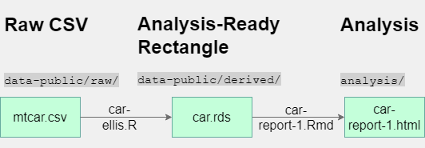
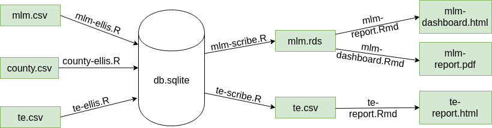

R Analysis Skeleton
=====================

> [No one beginning a data science project should start from a blinking cursor.](https://towardsdatascience.com/better-collaborative-data-science-d2006b9c0d39)  ...Templatization is a best practice for things like using common directory structure across projects... 
> -[Megan Risdal](https://towardsdatascience.com/@meganrisdal) Kaggle Product Lead.

This project contains the files and settings commonly used in analysis projects with R.  A developer can start an analysis repository more quickly by copying these files.  The purpose of each directory is described in its README file.  Some aspects are more thoroughly described in [Collaborative Data Science Practices](https://ouhscbbmc.github.io/data-science-practices-1/).

Pipelines
=====================

The repo contains two pipelines that aim to be simple enough to understand, yet complex enough to mimic aspects frequently seen in analysis projects.

Cars
--------------------------

The simplest example involves a csv that is lightly groomed and saved as an [rds]() file.  A knitr Rmd file analyzes the rds; the text, graphs, and tables are saved as a self-contained html.  The html file is very portable; it can be saved on a drive, emailed to a colleague, or publicly served on a website.

Intra-individual Differences
--------------------------

 Most nontrivial data science projects require multiple sources to address a single issue.  This example uses three sources: (a) longitudinal measurements for individuals across time (`mlm.csv`), (b) static county characteristics (`county.csv`), and (c) longintudinal county-level characteristics (`te.csv`).  Each csv is independently groomed and loaded into its own database table (in `db.sqlite`) by an **ellis lane**.  Conventional statistical software is not designed to digest multiple data rectangles; a **scribe** transforms multple   [database-normalized](https://www.essentialsql.com/get-ready-to-learn-sql-database-normalization-explained-in-simple-english/) tables into a single rds that can be analyzed directly.  In this case, the `mlm.rds` supports two analyses: a conventional **report** of statistical inferences intended for subject-experts concerned with complex hypotheses, and a **dashboard** of simplified patterns intended for administrators concerned with operational progress.  The `te.rds` supports a comparison of the *t*ime and *e*ffort results between counties.

