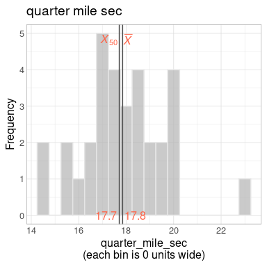
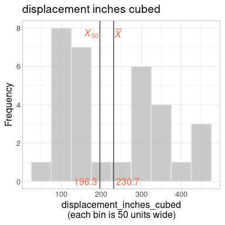
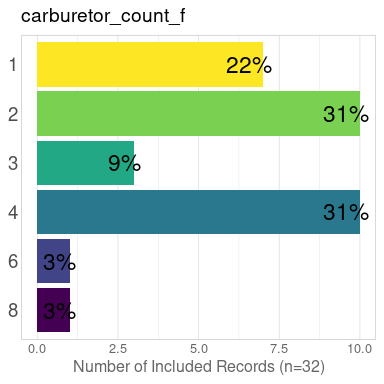
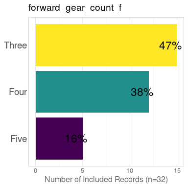
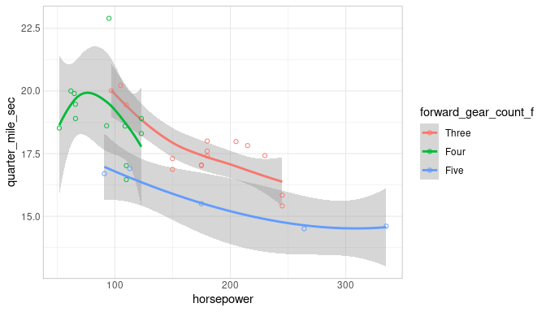
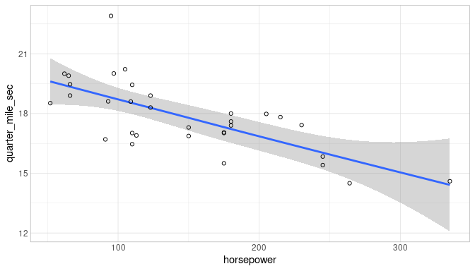
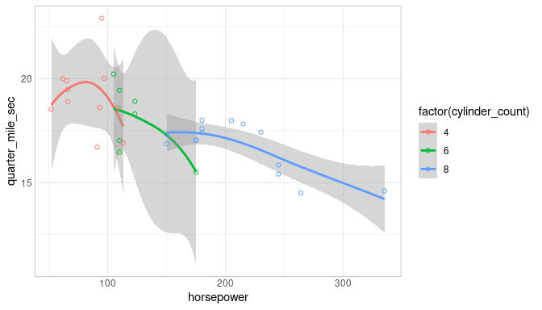
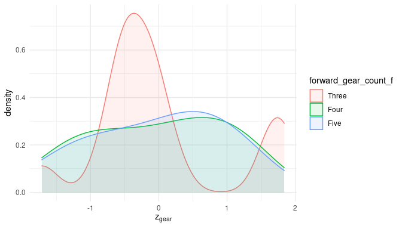

This report covers the analyses used in the ZZZ project (Marcus Mark, PI).

<!--  Set the working directory to the repository's base directory; this assumes the report is nested inside of two directories.-->


<!-- Set the report-wide options, and point to the external code file. -->


<!-- Load 'sourced' R files.  Suppress the output when loading sources. -->


<!-- Load packages, or at least verify they're available on the local machine.  Suppress the output when loading packages. -->


<!-- Load any global functions and variables declared in the R file.  Suppress the output. -->


<!-- Declare any global functions specific to a Rmd output.  Suppress the output. -->


<!-- Load the datasets.   -->


<!-- Tweak the datasets.   -->


Summary {.tabset .tabset-fade .tabset-pills}
===========================================================================

Notes
---------------------------------------------------------------------------

1. The current report covers 32 cars, with 6 unique values for `carburetor_count`.
1. The Seattle track's phluguerstometer was producing flaky negative values; it's measurements have been dropped.


Unanswered Questions
---------------------------------------------------------------------------

1. What does `VS` stand for?  How was it measured?
1. Where the cars at the Philly track measured with the same phluguerstometer and the Cleveland track?


Answered Questions
---------------------------------------------------------------------------

1. The Seattle track's phluguerstometer was producing flaky negative values; it's measurements have been dropped.


Graphs
===========================================================================


Marginals
---------------------------------------------------------------------------

<!-- --><!-- --><!-- --><!-- -->


Scatterplots
---------------------------------------------------------------------------

<!-- --><!-- --><!-- --><!-- --><!-- -->


Models
===========================================================================

Model Exploration
---------------------------------------------------------------------------

```
============= Simple model that's just an intercept. =============
```

```

Call:
lm(formula = quarter_mile_sec ~ 1, data = ds)

Residuals:
    Min      1Q  Median      3Q     Max 
-3.3487 -0.9563 -0.1387  1.0512  5.0512 

Coefficients:
            Estimate Std. Error t value Pr(>|t|)
(Intercept)  17.8488     0.3159    56.5   <2e-16

Residual standard error: 1.787 on 31 degrees of freedom
```

```
============= Model includes one predictor. =============
```

```

Call:
lm(formula = quarter_mile_sec ~ 1 + miles_per_gallon, data = ds)

Residuals:
    Min      1Q  Median      3Q     Max 
-2.8161 -1.0287  0.0954  0.8623  4.7149 

Coefficients:
                 Estimate Std. Error t value Pr(>|t|)
(Intercept)      15.35477    1.02978  14.911 2.05e-15
miles_per_gallon  0.12414    0.04916   2.525   0.0171

Residual standard error: 1.65 on 30 degrees of freedom
Multiple R-squared:  0.1753,	Adjusted R-squared:  0.1478 
F-statistic: 6.377 on 1 and 30 DF,  p-value: 0.01708
```

```
The one predictor is significantly tighter.
```

```
Analysis of Variance Table

Model 1: quarter_mile_sec ~ 1
Model 2: quarter_mile_sec ~ 1 + miles_per_gallon
  Res.Df    RSS Df Sum of Sq      F  Pr(>F)
1     31 98.988                            
2     30 81.636  1    17.352 6.3767 0.01708
```

```
============= Model includes two predictors. =============
```

```

Call:
lm(formula = quarter_mile_sec ~ 1 + miles_per_gallon + forward_gear_count_f, 
    data = ds)

Residuals:
    Min      1Q  Median      3Q     Max 
-2.0370 -0.5882 -0.1602  0.5428  4.1646 

Coefficients:
                         Estimate Std. Error t value Pr(>|t|)
(Intercept)              15.55851    0.89782  17.329  < 2e-16
miles_per_gallon          0.13246    0.05164   2.565 0.015963
forward_gear_count_fFour  0.15680    0.66819   0.235 0.816173
forward_gear_count_fFive -2.75051    0.72888  -3.774 0.000768

Residual standard error: 1.309 on 28 degrees of freedom
Multiple R-squared:  0.5151,	Adjusted R-squared:  0.4632 
F-statistic: 9.916 on 3 and 28 DF,  p-value: 0.0001272
```

```
The two predictor is significantly tighter.
```

```
Analysis of Variance Table

Model 1: quarter_mile_sec ~ 1 + miles_per_gallon
Model 2: quarter_mile_sec ~ 1 + miles_per_gallon + forward_gear_count_f
  Res.Df    RSS Df Sum of Sq      F    Pr(>F)
1     30 81.636                              
2     28 47.996  2     33.64 9.8124 0.0005896
```


Final Model
---------------------------------------------------------------------------


|                         | Estimate| Std. Error| t value| Pr(>&#124;t&#124;)|
|:------------------------|--------:|----------:|-------:|------------------:|
|(Intercept)              |    15.56|       0.90|   17.33|               0.00|
|miles_per_gallon         |     0.13|       0.05|    2.57|               0.02|
|forward_gear_count_fFour |     0.16|       0.67|    0.23|               0.82|
|forward_gear_count_fFive |    -2.75|       0.73|   -3.77|               0.00|

In the model that includes two predictors, the slope coefficent of `Miles per gallon` is 0.13246.


Session Information {#session-info}
===========================================================================

For the sake of documentation and reproducibility, the current report was rendered in the following environment.  Click the line below to expand.

<details>
  <summary>Environment <span class="glyphicon glyphicon-plus-sign"></span></summary>

```
- Session info ----------------------------------------------------
 setting  value                                      
 version  R version 4.0.2 Patched (2020-06-23 r78741)
 os       Windows 10 x64                             
 system   x86_64, mingw32                            
 ui       RStudio                                    
 language (EN)                                       
 collate  English_United States.1252                 
 ctype    English_United States.1252                 
 tz       America/Chicago                            
 date     2020-07-16                                 

- Packages --------------------------------------------------------
 package     * version    date       lib
 assertthat    0.2.1      2019-03-21 [1]
 backports     1.1.8      2020-06-17 [1]
 bit           1.1-15.2   2020-02-10 [1]
 bit64         0.9-7.1    2020-07-15 [1]
 blob          1.2.1      2020-01-20 [1]
 callr         3.4.3      2020-03-28 [1]
 checkmate     2.0.0      2020-02-06 [1]
 cli           2.0.2      2020-02-28 [1]
 colorspace    1.4-1      2019-03-18 [1]
 config        0.3        2018-03-27 [1]
 crayon        1.3.4      2017-09-16 [1]
 DBI           1.1.0      2019-12-15 [1]
 desc          1.2.0      2018-05-01 [1]
 devtools      2.3.0      2020-04-10 [1]
 digest        0.6.25     2020-02-23 [1]
 dplyr         1.0.0      2020-05-29 [1]
 ellipsis      0.3.1      2020-05-15 [1]
 evaluate      0.14       2019-05-28 [1]
 fansi         0.4.1      2020-01-08 [1]
 farver        2.0.3      2020-01-16 [1]
 fs            1.4.2      2020-06-30 [1]
 generics      0.0.2      2018-11-29 [1]
 ggplot2     * 3.3.2      2020-06-19 [1]
 glue          1.4.1      2020-05-13 [1]
 gtable        0.3.0      2019-03-25 [1]
 highr         0.8        2019-03-20 [1]
 hms           0.5.3      2020-01-08 [1]
 htmltools     0.5.0      2020-06-16 [1]
 import        1.1.0      2015-06-22 [1]
 knitr       * 1.29       2020-06-23 [1]
 labeling      0.3        2014-08-23 [1]
 lattice       0.20-41    2020-04-02 [2]
 lifecycle     0.2.0      2020-03-06 [1]
 lubridate     1.7.9      2020-06-08 [1]
 magrittr      1.5        2014-11-22 [1]
 Matrix        1.2-18     2019-11-27 [2]
 memoise       1.1.0      2017-04-21 [1]
 mgcv          1.8-31     2019-11-09 [2]
 munsell       0.5.0      2018-06-12 [1]
 nlme          3.1-148    2020-05-24 [2]
 odbc          1.2.3      2020-06-18 [1]
 OuhscMunge    0.1.9.9012 2020-04-28 [1]
 packrat       0.5.0      2018-11-14 [1]
 pillar        1.4.6      2020-07-10 [1]
 pkgbuild      1.1.0      2020-07-13 [1]
 pkgconfig     2.0.3      2019-09-22 [1]
 pkgload       1.1.0      2020-05-29 [1]
 prettyunits   1.1.1      2020-01-24 [1]
 processx      3.4.3      2020-07-05 [1]
 ps            1.3.3      2020-05-08 [1]
 purrr         0.3.4      2020-04-17 [1]
 R6            2.4.1      2019-11-12 [1]
 Rcpp          1.0.5      2020-07-06 [1]
 readr         1.3.1      2018-12-21 [1]
 remotes       2.1.1      2020-02-15 [1]
 rlang         0.4.7      2020-07-09 [1]
 rmarkdown     2.3        2020-06-18 [1]
 rprojroot     1.3-2      2018-01-03 [1]
 RSQLite       2.2.0      2020-01-07 [1]
 rstudioapi    0.11       2020-02-07 [1]
 scales        1.1.1      2020-05-11 [1]
 sessioninfo   1.1.1      2018-11-05 [1]
 stringi       1.4.6      2020-02-17 [1]
 stringr       1.4.0      2019-02-10 [1]
 testit        0.11       2019-11-12 [1]
 testthat      2.3.2      2020-03-02 [1]
 tibble        3.0.3      2020-07-10 [1]
 tidyr         1.1.0      2020-05-20 [1]
 tidyselect    1.1.0      2020-05-11 [1]
 usethis       1.6.1      2020-04-29 [1]
 vctrs         0.3.2      2020-07-15 [1]
 viridisLite   0.3.0      2018-02-01 [1]
 withr         2.2.0      2020-04-20 [1]
 xfun          0.15       2020-06-21 [1]
 yaml          2.2.1      2020-02-01 [1]
 zoo           1.8-8      2020-05-02 [1]
 source                               
 CRAN (R 4.0.0)                       
 CRAN (R 4.0.0)                       
 CRAN (R 4.0.0)                       
 CRAN (R 4.0.2)                       
 CRAN (R 4.0.0)                       
 CRAN (R 4.0.0)                       
 CRAN (R 4.0.0)                       
 CRAN (R 4.0.0)                       
 CRAN (R 4.0.0)                       
 CRAN (R 4.0.0)                       
 CRAN (R 4.0.0)                       
 CRAN (R 4.0.0)                       
 CRAN (R 4.0.0)                       
 CRAN (R 4.0.0)                       
 CRAN (R 4.0.0)                       
 CRAN (R 4.0.0)                       
 CRAN (R 4.0.0)                       
 CRAN (R 4.0.0)                       
 CRAN (R 4.0.0)                       
 CRAN (R 4.0.0)                       
 CRAN (R 4.0.2)                       
 CRAN (R 4.0.0)                       
 CRAN (R 4.0.2)                       
 CRAN (R 4.0.0)                       
 CRAN (R 4.0.0)                       
 CRAN (R 4.0.0)                       
 CRAN (R 4.0.0)                       
 CRAN (R 4.0.0)                       
 CRAN (R 4.0.0)                       
 CRAN (R 4.0.0)                       
 CRAN (R 4.0.0)                       
 CRAN (R 4.0.2)                       
 CRAN (R 4.0.0)                       
 CRAN (R 4.0.0)                       
 CRAN (R 4.0.0)                       
 CRAN (R 4.0.2)                       
 CRAN (R 4.0.0)                       
 CRAN (R 4.0.2)                       
 CRAN (R 4.0.0)                       
 CRAN (R 4.0.2)                       
 CRAN (R 4.0.0)                       
 Github (OuhscBbmc/OuhscMunge@8ad8f68)
 CRAN (R 4.0.0)                       
 CRAN (R 4.0.2)                       
 CRAN (R 4.0.2)                       
 CRAN (R 4.0.0)                       
 CRAN (R 4.0.0)                       
 CRAN (R 4.0.0)                       
 CRAN (R 4.0.2)                       
 CRAN (R 4.0.0)                       
 CRAN (R 4.0.0)                       
 CRAN (R 4.0.0)                       
 CRAN (R 4.0.2)                       
 CRAN (R 4.0.0)                       
 CRAN (R 4.0.0)                       
 CRAN (R 4.0.2)                       
 CRAN (R 4.0.0)                       
 CRAN (R 4.0.0)                       
 CRAN (R 4.0.0)                       
 CRAN (R 4.0.0)                       
 CRAN (R 4.0.0)                       
 CRAN (R 4.0.0)                       
 CRAN (R 4.0.0)                       
 CRAN (R 4.0.0)                       
 CRAN (R 4.0.0)                       
 CRAN (R 4.0.0)                       
 CRAN (R 4.0.2)                       
 CRAN (R 4.0.0)                       
 CRAN (R 4.0.0)                       
 CRAN (R 4.0.0)                       
 CRAN (R 4.0.2)                       
 CRAN (R 4.0.0)                       
 CRAN (R 4.0.0)                       
 CRAN (R 4.0.2)                       
 CRAN (R 4.0.0)                       
 CRAN (R 4.0.0)                       

[1] C:/Users/wbeasley/Documents/R/win-library/4.0
[2] C:/Program Files/R/R-4.0.2patched/library
```
</details>


Report rendered by WBEASLEY at 2020-07-16, 00:13 -0500 in 6 seconds.
