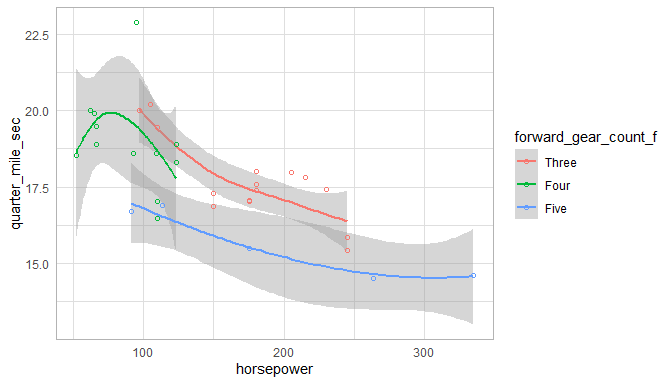

This report covers the analyses used in the ZZZ project (Marcus Mark, PI).

<!--  Set the working directory to the repository's base directory; this assumes the report is nested inside of two directories.-->


<!-- Set the report-wide options, and point to the external code file. -->


<!-- Load 'sourced' R files.  Suppress the output when loading sources. -->


<!-- Load packages, or at least verify they're available on the local machine.  Suppress the output when loading packages. -->


<!-- Load any global functions and variables declared in the R file.  Suppress the output. -->


<!-- Declare any global functions specific to a Rmd output.  Suppress the output. -->


<!-- Load the datasets.   -->


<!-- Tweak the datasets.   -->


Summary {.tabset .tabset-fade .tabset-pills}
===========================================================================

Notes
---------------------------------------------------------------------------

1. The current report covers 32 cars, with 6 unique values for `carburetor_count`.
1. The Seattle track's phluguerstometer was producing flaky negative values; it's measurements have been dropped.


Unanswered Questions
---------------------------------------------------------------------------

1. What does `VS` stand for?  How was it measured?
1. Where the cars at the Philly track measured with the same phluguerstometer and the Cleveland track?


Answered Questions
---------------------------------------------------------------------------

1. The Seattle track's phluguerstometer was producing flaky negative values; it's measurements have been dropped.


Graphs
===========================================================================


Marginals
---------------------------------------------------------------------------


Scatterplots
---------------------------------------------------------------------------




Models
===========================================================================

Model Exploration
---------------------------------------------------------------------------

```
============= Simple model that's just an intercept. =============
```

```

Call:
lm(formula = quarter_mile_sec ~ 1, data = ds)

Residuals:
    Min      1Q  Median      3Q     Max 
-3.3487 -0.9563 -0.1387  1.0512  5.0512 

Coefficients:
            Estimate Std. Error t value Pr(>|t|)
(Intercept)  17.8488     0.3159    56.5   <2e-16

Residual standard error: 1.787 on 31 degrees of freedom
```

```
============= Model includes one predictor. =============
```

```

Call:
lm(formula = quarter_mile_sec ~ 1 + miles_per_gallon, data = ds)

Residuals:
    Min      1Q  Median      3Q     Max 
-2.8161 -1.0287  0.0954  0.8623  4.7149 

Coefficients:
                 Estimate Std. Error t value Pr(>|t|)
(Intercept)      15.35477    1.02978  14.911 2.05e-15
miles_per_gallon  0.12414    0.04916   2.525   0.0171

Residual standard error: 1.65 on 30 degrees of freedom
Multiple R-squared:  0.1753,	Adjusted R-squared:  0.1478 
F-statistic: 6.377 on 1 and 30 DF,  p-value: 0.01708
```

```
The one predictor is significantly tighter.
```

```
Analysis of Variance Table

Model 1: quarter_mile_sec ~ 1
Model 2: quarter_mile_sec ~ 1 + miles_per_gallon
  Res.Df    RSS Df Sum of Sq      F  Pr(>F)
1     31 98.988                            
2     30 81.636  1    17.352 6.3767 0.01708
```

```
============= Model includes two predictors. =============
```

```

Call:
lm(formula = quarter_mile_sec ~ 1 + miles_per_gallon + forward_gear_count_f, 
    data = ds)

Residuals:
    Min      1Q  Median      3Q     Max 
-2.0370 -0.5882 -0.1602  0.5428  4.1646 

Coefficients:
                         Estimate Std. Error t value Pr(>|t|)
(Intercept)              15.55851    0.89782  17.329  < 2e-16
miles_per_gallon          0.13246    0.05164   2.565 0.015963
forward_gear_count_fFour  0.15680    0.66819   0.235 0.816173
forward_gear_count_fFive -2.75051    0.72888  -3.774 0.000768

Residual standard error: 1.309 on 28 degrees of freedom
Multiple R-squared:  0.5151,	Adjusted R-squared:  0.4632 
F-statistic: 9.916 on 3 and 28 DF,  p-value: 0.0001272
```

```
The two predictor is significantly tighter.
```

```
Analysis of Variance Table

Model 1: quarter_mile_sec ~ 1 + miles_per_gallon
Model 2: quarter_mile_sec ~ 1 + miles_per_gallon + forward_gear_count_f
  Res.Df    RSS Df Sum of Sq      F    Pr(>F)
1     30 81.636                              
2     28 47.996  2     33.64 9.8124 0.0005896
```


Final Model
---------------------------------------------------------------------------


|                         | Estimate| Std. Error| t value| Pr(>&#124;t&#124;)|
|:------------------------|--------:|----------:|-------:|------------------:|
|(Intercept)              |    15.56|       0.90|   17.33|               0.00|
|miles_per_gallon         |     0.13|       0.05|    2.57|               0.02|
|forward_gear_count_fFour |     0.16|       0.67|    0.23|               0.82|
|forward_gear_count_fFive |    -2.75|       0.73|   -3.77|               0.00|

In the model that includes two predictors, the slope coefficent of `Miles per gallon` is 0.13246.


Session Information {#session-info}
===========================================================================

For the sake of documentation and reproducibility, the current report was rendered in the following environment.  Click the line below to expand.

<details>
  <summary>Environment <span class="glyphicon glyphicon-plus-sign"></span></summary>

```
─ Session info ──────────────────────────────────────────────────────────
 setting  value                       
 version  R version 3.5.2 (2018-12-20)
 os       Ubuntu 18.04.2 LTS          
 system   x86_64, linux-gnu           
 ui       RStudio                     
 language (EN)                        
 collate  en_US.UTF-8                 
 ctype    en_US.UTF-8                 
 tz       America/Chicago             
 date     2019-02-27                  

─ Packages ──────────────────────────────────────────────────────────────
 package     * version    date       lib source                        
 assertthat    0.2.0      2017-04-11 [1] CRAN (R 3.5.1)                
 backports     1.1.3      2018-12-14 [1] CRAN (R 3.5.2)                
 bit           1.1-14     2018-05-29 [1] CRAN (R 3.5.1)                
 bit64         0.9-7      2017-05-08 [1] CRAN (R 3.5.1)                
 blob          1.1.1      2018-03-25 [1] CRAN (R 3.5.1)                
 callr         3.1.1      2018-12-21 [1] CRAN (R 3.5.2)                
 checkmate     1.9.1      2019-01-15 [1] CRAN (R 3.5.2)                
 cli           1.0.1      2018-09-25 [1] CRAN (R 3.5.1)                
 colorspace    1.4-0      2019-01-13 [1] CRAN (R 3.5.2)                
 config        0.3        2018-03-27 [1] CRAN (R 3.5.1)                
 crayon        1.3.4      2017-09-16 [1] CRAN (R 3.5.1)                
 DBI           1.0.0      2018-05-02 [1] CRAN (R 3.5.1)                
 desc          1.2.0      2018-05-01 [1] CRAN (R 3.5.1)                
 devtools      2.0.1      2018-10-26 [1] CRAN (R 3.5.1)                
 digest        0.6.18     2018-10-10 [1] CRAN (R 3.5.1)                
 dplyr         0.8.0.1    2019-02-15 [1] CRAN (R 3.5.2)                
 evaluate      0.13       2019-02-12 [1] CRAN (R 3.5.2)                
 fs            1.2.6      2018-08-23 [1] CRAN (R 3.5.1)                
 ggplot2     * 3.1.0      2018-10-25 [1] CRAN (R 3.5.1)                
 glue          1.3.0      2018-07-17 [1] CRAN (R 3.5.1)                
 gtable        0.2.0      2016-02-26 [1] CRAN (R 3.5.1)                
 highr         0.7        2018-06-09 [1] CRAN (R 3.5.1)                
 hms           0.4.2.9001 2018-08-18 [1] Github (tidyverse/hms@979286f)
 htmltools     0.3.6      2017-04-28 [1] CRAN (R 3.5.1)                
 knitr       * 1.21       2018-12-10 [1] CRAN (R 3.5.1)                
 labeling      0.3        2014-08-23 [1] CRAN (R 3.5.1)                
 lattice       0.20-38    2018-11-04 [4] CRAN (R 3.5.1)                
 lazyeval      0.2.1      2017-10-29 [1] CRAN (R 3.5.1)                
 lubridate     1.7.4      2018-04-11 [1] CRAN (R 3.5.1)                
 magrittr    * 1.5        2014-11-22 [1] CRAN (R 3.5.1)                
 memoise       1.1.0      2017-04-21 [1] CRAN (R 3.5.1)                
 munsell       0.5.0      2018-06-12 [1] CRAN (R 3.5.1)                
 odbc          1.1.6      2018-06-09 [1] CRAN (R 3.5.1)                
 OuhscMunge    0.1.9.9010 2019-02-28 [1] local                         
 packrat       0.5.0      2018-11-14 [1] CRAN (R 3.5.1)                
 pillar        1.3.1      2018-12-15 [1] CRAN (R 3.5.2)                
 pkgbuild      1.0.2      2018-10-16 [1] CRAN (R 3.5.1)                
 pkgconfig     2.0.2      2018-08-16 [1] CRAN (R 3.5.1)                
 pkgload       1.0.2      2018-10-29 [1] CRAN (R 3.5.1)                
 plyr          1.8.4      2016-06-08 [1] CRAN (R 3.5.1)                
 prettyunits   1.0.2      2015-07-13 [1] CRAN (R 3.5.1)                
 processx      3.2.1      2018-12-05 [1] CRAN (R 3.5.1)                
 ps            1.3.0      2018-12-21 [1] CRAN (R 3.5.2)                
 purrr         0.3.0      2019-01-27 [1] CRAN (R 3.5.2)                
 R6            2.4.0      2019-02-14 [1] CRAN (R 3.5.2)                
 Rcpp          1.0.0      2018-11-07 [1] CRAN (R 3.5.1)                
 RcppRoll      0.3.0      2018-06-05 [1] CRAN (R 3.5.1)                
 readr         1.3.1      2018-12-21 [1] CRAN (R 3.5.2)                
 remotes       2.0.2      2018-10-30 [1] CRAN (R 3.5.1)                
 rlang         0.3.1      2019-01-08 [1] CRAN (R 3.5.2)                
 rmarkdown     1.11       2018-12-08 [1] CRAN (R 3.5.1)                
 rprojroot     1.3-2      2018-01-03 [1] CRAN (R 3.5.1)                
 RSQLite       2.1.1      2018-05-06 [1] CRAN (R 3.5.1)                
 scales        1.0.0.9000 2019-01-11 [1] local                         
 sessioninfo   1.1.1      2018-11-05 [1] CRAN (R 3.5.1)                
 stringi       1.3.1      2019-02-13 [1] CRAN (R 3.5.2)                
 stringr       1.4.0      2019-02-10 [1] CRAN (R 3.5.2)                
 testit        0.9        2018-12-05 [1] CRAN (R 3.5.1)                
 testthat      2.0.1      2018-10-13 [1] CRAN (R 3.5.1)                
 tibble        2.0.1      2019-01-12 [1] CRAN (R 3.5.2)                
 tidyr         0.8.2      2018-10-28 [1] CRAN (R 3.5.1)                
 tidyselect    0.2.5      2018-10-11 [1] CRAN (R 3.5.1)                
 usethis       1.4.0      2018-08-14 [1] CRAN (R 3.5.1)                
 viridisLite   0.3.0      2018-02-01 [1] CRAN (R 3.5.1)                
 withr         2.1.2      2018-03-15 [1] CRAN (R 3.5.1)                
 xfun          0.5        2019-02-20 [1] CRAN (R 3.5.2)                
 yaml          2.2.0      2018-07-25 [1] CRAN (R 3.5.1)                
 zoo           1.8-4      2018-09-19 [1] CRAN (R 3.5.1)                

[1] /home/wibeasley/R/x86_64-pc-linux-gnu-library/3.5
[2] /usr/local/lib/R/site-library
[3] /usr/lib/R/site-library
[4] /usr/lib/R/library
```
</details>


Report rendered by wibeasley at 2019-02-27, 21:16 -0600 in 7 seconds.
