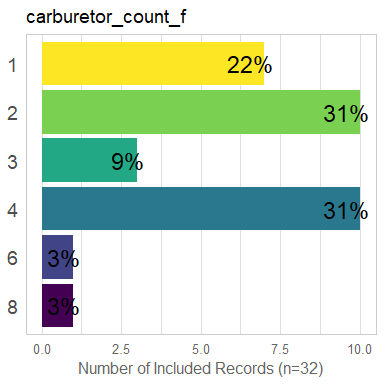
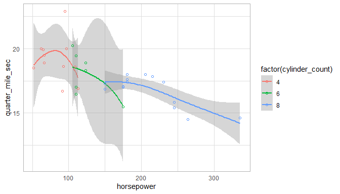

This report covers the analyses used in the ZZZ project (Marcus Mark, PI).

<!--  Set the working directory to the repository's base directory; this assumes the report is nested inside of two directories.-->


<!-- Set the report-wide options, and point to the external code file. -->


<!-- Load 'sourced' R files.  Suppress the output when loading sources. -->


<!-- Load packages, or at least verify they're available on the local machine.  Suppress the output when loading packages. -->


<!-- Load any global functions and variables declared in the R file.  Suppress the output. -->


<!-- Declare any global functions specific to a Rmd output.  Suppress the output. -->


<!-- Load the datasets.   -->


<!-- Tweak the datasets.   -->


Summary {.tabset .tabset-fade .tabset-pills}
===========================================================================

Notes
---------------------------------------------------------------------------

1. The current report covers 32 cars, with 6 unique values for `carburetor_count`.
1. The Seattle track's phluguerstometer was producing flaky negative values; it's measurements have been dropped.


Unanswered Questions
---------------------------------------------------------------------------

1. What does `VS` stand for?  How was it measured?
1. Where the cars at the Philly track measured with the same phluguerstometer and the Cleveland track?


Answered Questions
---------------------------------------------------------------------------

1. The Seattle track's phluguerstometer was producing flaky negative values; it's measurements have been dropped.


Graphs
===========================================================================


Marginals
---------------------------------------------------------------------------

<!-- --><!-- --><!-- --><!-- -->


Scatterplots
---------------------------------------------------------------------------

<!-- --><!-- --><!-- --><!-- --><!-- -->


Models
===========================================================================

Model Exploration
---------------------------------------------------------------------------

```
============= Simple model that's just an intercept. =============
```

```

Call:
lm(formula = quarter_mile_sec ~ 1, data = ds)

Residuals:
    Min      1Q  Median      3Q     Max 
-3.3487 -0.9563 -0.1387  1.0512  5.0512 

Coefficients:
            Estimate Std. Error t value Pr(>|t|)
(Intercept)  17.8488     0.3159    56.5   <2e-16

Residual standard error: 1.787 on 31 degrees of freedom
```

```
============= Model includes one predictor. =============
```

```

Call:
lm(formula = quarter_mile_sec ~ 1 + miles_per_gallon, data = ds)

Residuals:
    Min      1Q  Median      3Q     Max 
-2.8161 -1.0287  0.0954  0.8623  4.7149 

Coefficients:
                 Estimate Std. Error t value Pr(>|t|)
(Intercept)      15.35477    1.02978  14.911 2.05e-15
miles_per_gallon  0.12414    0.04916   2.525   0.0171

Residual standard error: 1.65 on 30 degrees of freedom
Multiple R-squared:  0.1753,	Adjusted R-squared:  0.1478 
F-statistic: 6.377 on 1 and 30 DF,  p-value: 0.01708
```

```
The one predictor is significantly tighter.
```

```
Analysis of Variance Table

Model 1: quarter_mile_sec ~ 1
Model 2: quarter_mile_sec ~ 1 + miles_per_gallon
  Res.Df    RSS Df Sum of Sq      F  Pr(>F)
1     31 98.988                            
2     30 81.636  1    17.352 6.3767 0.01708
```

```
============= Model includes two predictors. =============
```

```

Call:
lm(formula = quarter_mile_sec ~ 1 + miles_per_gallon + forward_gear_count_f, 
    data = ds)

Residuals:
    Min      1Q  Median      3Q     Max 
-2.0370 -0.5882 -0.1602  0.5428  4.1646 

Coefficients:
                         Estimate Std. Error t value Pr(>|t|)
(Intercept)              15.55851    0.89782  17.329  < 2e-16
miles_per_gallon          0.13246    0.05164   2.565 0.015963
forward_gear_count_fFour  0.15680    0.66819   0.235 0.816173
forward_gear_count_fFive -2.75051    0.72888  -3.774 0.000768

Residual standard error: 1.309 on 28 degrees of freedom
Multiple R-squared:  0.5151,	Adjusted R-squared:  0.4632 
F-statistic: 9.916 on 3 and 28 DF,  p-value: 0.0001272
```

```
The two predictor is significantly tighter.
```

```
Analysis of Variance Table

Model 1: quarter_mile_sec ~ 1 + miles_per_gallon
Model 2: quarter_mile_sec ~ 1 + miles_per_gallon + forward_gear_count_f
  Res.Df    RSS Df Sum of Sq      F    Pr(>F)
1     30 81.636                              
2     28 47.996  2     33.64 9.8124 0.0005896
```


Final Model
---------------------------------------------------------------------------


|                         | Estimate| Std. Error| t value| Pr(>&#124;t&#124;)|
|:------------------------|--------:|----------:|-------:|------------------:|
|(Intercept)              |    15.56|       0.90|   17.33|               0.00|
|miles_per_gallon         |     0.13|       0.05|    2.57|               0.02|
|forward_gear_count_fFour |     0.16|       0.67|    0.23|               0.82|
|forward_gear_count_fFive |    -2.75|       0.73|   -3.77|               0.00|

In the model that includes two predictors, the slope coefficent of `Miles per gallon` is 0.13246.


Session Information {#session-info}
===========================================================================

For the sake of documentation and reproducibility, the current report was rendered in the following environment.  Click the line below to expand.

<details>
  <summary>Environment <span class="glyphicon glyphicon-plus-sign"></span></summary>

```
─ Session info ────────────────────────────────────────────────────────────────────────
 setting  value                       
 version  R version 4.1.1 (2021-08-10)
 os       Ubuntu 21.04                
 system   x86_64, linux-gnu           
 ui       RStudio                     
 language (EN)                        
 collate  en_US.UTF-8                 
 ctype    en_US.UTF-8                 
 tz       America/Chicago             
 date     2021-10-14                  

─ Packages ────────────────────────────────────────────────────────────────────────────
 package     * version    date       lib source        
 assertthat    0.2.1      2019-03-21 [1] CRAN (R 4.1.0)
 backports     1.2.1      2020-12-09 [1] CRAN (R 4.1.0)
 bit           4.0.4      2020-08-04 [1] CRAN (R 4.1.0)
 bit64         4.0.5      2020-08-30 [1] CRAN (R 4.1.0)
 blob          1.2.2      2021-07-23 [1] CRAN (R 4.1.0)
 bslib         0.2.5.1    2021-05-18 [1] CRAN (R 4.1.0)
 cachem        1.0.6      2021-08-19 [1] CRAN (R 4.1.1)
 callr         3.7.0      2021-04-20 [1] CRAN (R 4.1.0)
 checkmate     2.0.0      2020-02-06 [1] CRAN (R 4.1.0)
 cli           3.0.1      2021-07-17 [1] CRAN (R 4.1.0)
 colorspace    2.0-2      2021-06-24 [1] CRAN (R 4.1.0)
 config        0.3.1      2020-12-17 [1] CRAN (R 4.1.0)
 crayon        1.4.1      2021-02-08 [1] CRAN (R 4.1.0)
 DBI           1.1.1      2021-01-15 [1] CRAN (R 4.1.0)
 desc          1.3.0      2021-03-05 [1] CRAN (R 4.1.0)
 devtools      2.4.2      2021-06-07 [1] CRAN (R 4.1.0)
 digest        0.6.27     2020-10-24 [1] CRAN (R 4.1.0)
 dplyr         1.0.7      2021-06-18 [1] CRAN (R 4.1.0)
 ellipsis      0.3.2      2021-04-29 [1] CRAN (R 4.1.0)
 evaluate      0.14       2019-05-28 [1] CRAN (R 4.1.0)
 fansi         0.5.0      2021-05-25 [1] CRAN (R 4.1.0)
 farver        2.1.0      2021-02-28 [1] CRAN (R 4.1.0)
 fastmap       1.1.0      2021-01-25 [1] CRAN (R 4.1.0)
 fs            1.5.0      2020-07-31 [1] CRAN (R 4.1.0)
 generics      0.1.0      2020-10-31 [1] CRAN (R 4.1.0)
 ggplot2     * 3.3.5      2021-06-25 [1] CRAN (R 4.1.0)
 glue          1.4.2      2020-08-27 [1] CRAN (R 4.1.0)
 gtable        0.3.0      2019-03-25 [1] CRAN (R 4.1.0)
 highr         0.9        2021-04-16 [1] CRAN (R 4.1.0)
 hms           1.1.0      2021-05-17 [1] CRAN (R 4.1.0)
 htmltools     0.5.1.1    2021-01-22 [1] CRAN (R 4.1.0)
 import        1.2.0      2020-09-24 [1] CRAN (R 4.1.0)
 jquerylib     0.1.4      2021-04-26 [1] CRAN (R 4.1.0)
 jsonlite      1.7.2      2020-12-09 [1] CRAN (R 4.1.0)
 knitr       * 1.33       2021-04-24 [1] CRAN (R 4.1.0)
 labeling      0.4.2      2020-10-20 [1] CRAN (R 4.1.0)
 lattice       0.20-45    2021-09-22 [4] CRAN (R 4.1.1)
 lifecycle     1.0.0      2021-02-15 [1] CRAN (R 4.1.0)
 lubridate     1.7.10     2021-02-26 [1] CRAN (R 4.1.0)
 magrittr      2.0.1      2020-11-17 [1] CRAN (R 4.1.0)
 Matrix        1.3-4      2021-06-01 [4] CRAN (R 4.1.0)
 memoise       2.0.0      2021-01-26 [1] CRAN (R 4.1.0)
 mgcv          1.8-37     2021-09-23 [4] CRAN (R 4.1.1)
 munsell       0.5.0      2018-06-12 [1] CRAN (R 4.1.0)
 nlme          3.1-152    2021-02-04 [4] CRAN (R 4.1.0)
 odbc          1.3.2      2021-04-03 [1] CRAN (R 4.1.0)
 OuhscMunge    0.2.0.9014 2021-06-18 [1] local         
 pillar        1.6.2      2021-07-29 [1] CRAN (R 4.1.1)
 pkgbuild      1.2.0      2020-12-15 [1] CRAN (R 4.1.0)
 pkgconfig     2.0.3      2019-09-22 [1] CRAN (R 4.1.0)
 pkgload       1.2.1      2021-04-06 [1] CRAN (R 4.1.0)
 png           0.1-7      2013-12-03 [1] CRAN (R 4.1.0)
 prettyunits   1.1.1      2020-01-24 [1] CRAN (R 4.1.0)
 processx      3.5.2      2021-04-30 [1] CRAN (R 4.1.0)
 ps            1.6.0      2021-02-28 [1] CRAN (R 4.1.0)
 purrr         0.3.4      2020-04-17 [1] CRAN (R 4.1.0)
 R6            2.5.1      2021-08-19 [1] CRAN (R 4.1.1)
 Rcpp          1.0.7      2021-07-07 [1] CRAN (R 4.1.0)
 readr         2.0.1      2021-08-10 [1] CRAN (R 4.1.1)
 remotes       2.4.0      2021-06-02 [1] CRAN (R 4.1.0)
 reticulate    1.20       2021-05-03 [1] CRAN (R 4.1.0)
 rlang         0.4.11     2021-04-30 [1] CRAN (R 4.1.0)
 rmarkdown     2.11       2021-09-14 [1] CRAN (R 4.1.1)
 rprojroot     2.0.2      2020-11-15 [1] CRAN (R 4.1.0)
 RSQLite       2.2.8      2021-08-21 [1] CRAN (R 4.1.1)
 rstudioapi    0.13       2020-11-12 [1] CRAN (R 4.1.0)
 sass          0.4.0      2021-05-12 [1] CRAN (R 4.1.0)
 scales        1.1.1      2020-05-11 [1] CRAN (R 4.1.0)
 sessioninfo   1.1.1      2018-11-05 [1] CRAN (R 4.1.0)
 stringi       1.7.3      2021-07-16 [1] CRAN (R 4.1.0)
 stringr       1.4.0      2019-02-10 [1] CRAN (R 4.1.0)
 testit        0.13       2021-04-14 [1] CRAN (R 4.1.0)
 testthat      3.0.4      2021-07-01 [1] CRAN (R 4.1.0)
 tibble        3.1.3      2021-07-23 [1] CRAN (R 4.1.0)
 tidyr         1.1.3      2021-03-03 [1] CRAN (R 4.1.0)
 tidyselect    1.1.1      2021-04-30 [1] CRAN (R 4.1.0)
 tzdb          0.1.2      2021-07-20 [1] CRAN (R 4.1.0)
 usethis       2.0.1      2021-02-10 [1] CRAN (R 4.1.0)
 utf8          1.2.2      2021-07-24 [1] CRAN (R 4.1.0)
 vctrs         0.3.8      2021-04-29 [1] CRAN (R 4.1.0)
 viridisLite   0.4.0      2021-04-13 [1] CRAN (R 4.1.0)
 vroom         1.5.4      2021-08-05 [1] CRAN (R 4.1.1)
 withr         2.4.2      2021-04-18 [1] CRAN (R 4.1.0)
 xfun          0.25       2021-08-06 [1] CRAN (R 4.1.1)
 yaml          2.2.1      2020-02-01 [1] CRAN (R 4.1.0)
 zoo           1.8-9      2021-03-09 [1] CRAN (R 4.1.0)

[1] /home/wibeasley/R/x86_64-pc-linux-gnu-library/4.1
[2] /usr/local/lib/R/site-library
[3] /usr/lib/R/site-library
[4] /usr/lib/R/library
```
</details>


Report rendered by wibeasley at 2021-10-14, 22:57 -0500 in 6 seconds.
