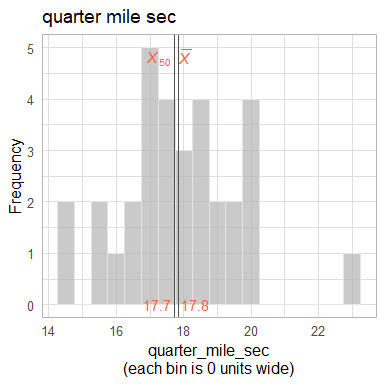
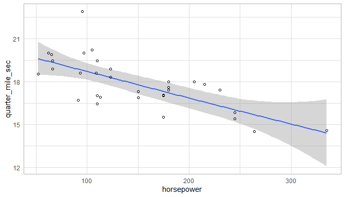
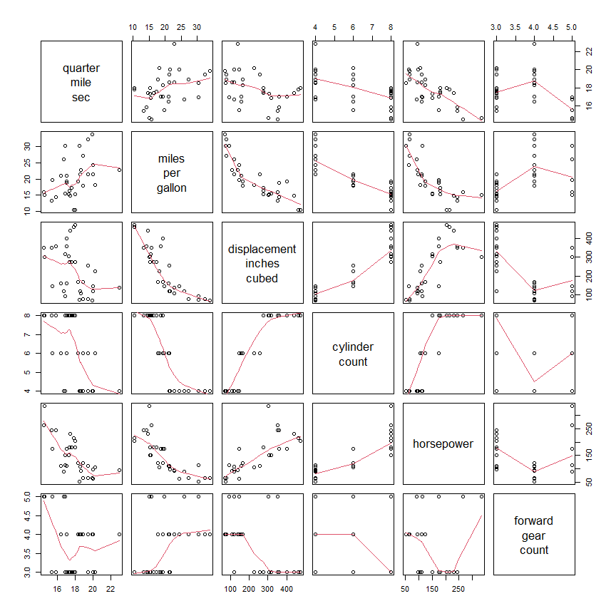

This report covers the analyses used in the ZZZ project (Marcus Mark, PI).

<!--  Set the working directory to the repository's base directory; this assumes the report is nested inside of two directories.-->


<!-- Set the report-wide options, and point to the external code file. -->


<!-- Load 'sourced' R files.  Suppress the output when loading sources. -->


<!-- Load packages, or at least verify they're available on the local machine.  Suppress the output when loading packages. -->


<!-- Load any global functions and variables declared in the R file.  Suppress the output. -->


<!-- Declare any global functions specific to a Rmd output.  Suppress the output. -->


<!-- Load the datasets.   -->


<!-- Tweak the datasets.   -->


Summary {.tabset .tabset-fade .tabset-pills}
===========================================================================

Notes
---------------------------------------------------------------------------

1. The current report covers 32 cars, with 6 unique values for `carburetor_count`.
1. The Seattle track's phluguerstometer was producing flaky negative values; it's measurements have been dropped.


Unanswered Questions
---------------------------------------------------------------------------

1. What does `VS` stand for?  How was it measured?
1. Where the cars at the Philly track measured with the same phluguerstometer and the Cleveland track?


Answered Questions
---------------------------------------------------------------------------

1. The Seattle track's phluguerstometer was producing flaky negative values; it's measurements have been dropped.


Graphs
===========================================================================


Marginals
---------------------------------------------------------------------------

<!-- --><!-- --><!-- --><!-- -->


Scatterplots
---------------------------------------------------------------------------

<!-- --><!-- --><!-- --><!-- -->


Correlation Matrixes
---------------------------------------------------------------------------

### Hyp 1: Prediction of quarter mile time

<!-- --><!-- -->

|                                | quarter<br>mile<br>sec| miles<br>per<br>gallon| displacement<br>inches<br>cubed| cylinder<br>count| horsepower| forward<br>gear<br>count|
|:-------------------------------|----------------------:|----------------------:|-------------------------------:|-----------------:|----------:|------------------------:|
|quarter<br>mile<br>sec          |                  1.000|                  0.419|                          -0.434|            -0.591|     -0.708|                   -0.213|
|miles<br>per<br>gallon          |                  0.419|                  1.000|                          -0.848|            -0.852|     -0.776|                    0.480|
|displacement<br>inches<br>cubed |                 -0.434|                 -0.848|                           1.000|             0.902|      0.791|                   -0.556|
|cylinder<br>count               |                 -0.591|                 -0.852|                           0.902|             1.000|      0.832|                   -0.493|
|horsepower                      |                 -0.708|                 -0.776|                           0.791|             0.832|      1.000|                   -0.126|
|forward<br>gear<br>count        |                 -0.213|                  0.480|                          -0.556|            -0.493|     -0.126|                    1.000|

### Hyp 2: Prediction of z-score of weight/gear

<!-- --><!-- -->

|                                | weight<br>gear<br>z| miles<br>per<br>gallon| displacement<br>inches<br>cubed| cylinder<br>count| horsepower| forward<br>gear<br>count|
|:-------------------------------|-------------------:|----------------------:|-------------------------------:|-----------------:|----------:|------------------------:|
|weight<br>gear<br>z             |               1.000|                 -0.614|                           0.515|             0.431|      0.496|                    0.000|
|miles<br>per<br>gallon          |              -0.614|                  1.000|                          -0.848|            -0.852|     -0.776|                    0.480|
|displacement<br>inches<br>cubed |               0.515|                 -0.848|                           1.000|             0.902|      0.791|                   -0.556|
|cylinder<br>count               |               0.431|                 -0.852|                           0.902|             1.000|      0.832|                   -0.493|
|horsepower                      |               0.496|                 -0.776|                           0.791|             0.832|      1.000|                   -0.126|
|forward<br>gear<br>count        |               0.000|                  0.480|                          -0.556|            -0.493|     -0.126|                    1.000|


Models
===========================================================================

Model Exploration
---------------------------------------------------------------------------

```
============= Simple model that's just an intercept. =============
```

```

Call:
lm(formula = quarter_mile_sec ~ 1, data = ds)

Residuals:
    Min      1Q  Median      3Q     Max 
-3.3487 -0.9563 -0.1387  1.0512  5.0512 

Coefficients:
            Estimate Std. Error t value Pr(>|t|)
(Intercept)  17.8488     0.3159    56.5   <2e-16

Residual standard error: 1.787 on 31 degrees of freedom
```

```
============= Model includes one predictor. =============
```

```

Call:
lm(formula = quarter_mile_sec ~ 1 + miles_per_gallon, data = ds)

Residuals:
    Min      1Q  Median      3Q     Max 
-2.8161 -1.0287  0.0954  0.8623  4.7149 

Coefficients:
                 Estimate Std. Error t value Pr(>|t|)
(Intercept)      15.35477    1.02978  14.911 2.05e-15
miles_per_gallon  0.12414    0.04916   2.525   0.0171

Residual standard error: 1.65 on 30 degrees of freedom
Multiple R-squared:  0.1753,	Adjusted R-squared:  0.1478 
F-statistic: 6.377 on 1 and 30 DF,  p-value: 0.01708
```

```
The one predictor is significantly tighter.
```

```
Analysis of Variance Table

Model 1: quarter_mile_sec ~ 1
Model 2: quarter_mile_sec ~ 1 + miles_per_gallon
  Res.Df    RSS Df Sum of Sq      F  Pr(>F)
1     31 98.988                            
2     30 81.636  1    17.352 6.3767 0.01708
```

```
============= Model includes two predictors. =============
```

```

Call:
lm(formula = quarter_mile_sec ~ 1 + miles_per_gallon + forward_gear_count_f, 
    data = ds)

Residuals:
    Min      1Q  Median      3Q     Max 
-2.0370 -0.5882 -0.1602  0.5428  4.1646 

Coefficients:
                         Estimate Std. Error t value Pr(>|t|)
(Intercept)              15.55851    0.89782  17.329  < 2e-16
miles_per_gallon          0.13246    0.05164   2.565 0.015963
forward_gear_count_fFour  0.15680    0.66819   0.235 0.816173
forward_gear_count_fFive -2.75051    0.72888  -3.774 0.000768

Residual standard error: 1.309 on 28 degrees of freedom
Multiple R-squared:  0.5151,	Adjusted R-squared:  0.4632 
F-statistic: 9.916 on 3 and 28 DF,  p-value: 0.0001272
```

```
The two predictor is significantly tighter.
```

```
Analysis of Variance Table

Model 1: quarter_mile_sec ~ 1 + miles_per_gallon
Model 2: quarter_mile_sec ~ 1 + miles_per_gallon + forward_gear_count_f
  Res.Df    RSS Df Sum of Sq      F    Pr(>F)
1     30 81.636                              
2     28 47.996  2     33.64 9.8124 0.0005896
```


Final Model
---------------------------------------------------------------------------


|                         | Estimate| Std. Error| t value| Pr(>&#124;t&#124;)|
|:------------------------|--------:|----------:|-------:|------------------:|
|(Intercept)              |    15.56|       0.90|   17.33|               0.00|
|miles_per_gallon         |     0.13|       0.05|    2.57|               0.02|
|forward_gear_count_fFour |     0.16|       0.67|    0.23|               0.82|
|forward_gear_count_fFive |    -2.75|       0.73|   -3.77|               0.00|

In the model that includes two predictors, the slope coefficent of `Miles per gallon` is 0.13246.


Session Information {#session-info}
===========================================================================

For the sake of documentation and reproducibility, the current report was rendered in the following environment.  Click the line below to expand.

<details>
  <summary>Environment <span class="glyphicon glyphicon-plus-sign"></span></summary>

```
─ Session info ─────────────────────────────────────────────────────────────────────────────────────────────────
 setting  value
 version  R version 4.2.2 Patched (2022-12-09 r83428 ucrt)
 os       Windows 10 x64 (build 22621)
 system   x86_64, mingw32
 ui       RStudio
 language (EN)
 collate  English_United States.utf8
 ctype    English_United States.utf8
 tz       America/Chicago
 date     2023-01-10
 rstudio  2022.12.0+353 Elsbeth Geranium (desktop)
 pandoc   2.19.2 @ C:/Program Files/RStudio/resources/app/bin/quarto/bin/tools/ (via rmarkdown)

─ Packages ─────────────────────────────────────────────────────────────────────────────────────────────────────
 ! package     * version    date (UTC) lib source
 D archive       1.1.5      2022-05-06 [1] CRAN (R 4.2.2)
   assertthat    0.2.1      2019-03-21 [1] CRAN (R 4.2.2)
   backports     1.4.1      2021-12-13 [1] CRAN (R 4.2.0)
   base        * 4.2.2      2022-12-10 [?] local
   bit           4.0.5      2022-11-15 [1] CRAN (R 4.2.2)
   bit64         4.0.5      2020-08-30 [1] CRAN (R 4.2.2)
   blob          1.2.3      2022-04-10 [1] CRAN (R 4.2.2)
   bslib         0.4.2      2022-12-16 [1] CRAN (R 4.2.2)
   cachem        1.0.6      2021-08-19 [1] CRAN (R 4.2.2)
   checkmate     2.1.0      2022-04-21 [1] CRAN (R 4.2.2)
   cli           3.6.0      2023-01-09 [1] CRAN (R 4.2.2)
   colorspace    2.0-3      2022-02-21 [1] CRAN (R 4.2.2)
 P compiler      4.2.2      2022-12-10 [2] local
   config        0.3.1      2020-12-17 [1] CRAN (R 4.2.2)
   corrplot      0.92       2021-11-18 [1] CRAN (R 4.2.2)
   crayon        1.5.2      2022-09-29 [1] CRAN (R 4.2.2)
 P datasets    * 4.2.2      2022-12-10 [2] local
   DBI           1.1.3      2022-06-18 [1] CRAN (R 4.2.2)
   digest        0.6.31     2022-12-11 [1] CRAN (R 4.2.2)
   dplyr         1.0.10     2022-09-01 [1] CRAN (R 4.2.2)
   ellipsis      0.3.2      2021-04-29 [1] CRAN (R 4.2.2)
   evaluate      0.19       2022-12-13 [1] CRAN (R 4.2.2)
   fansi         1.0.3      2022-03-24 [1] CRAN (R 4.2.2)
   farver        2.1.1      2022-07-06 [1] CRAN (R 4.2.2)
   fastmap       1.1.0      2021-01-25 [1] CRAN (R 4.2.2)
   fs            1.5.2      2021-12-08 [1] CRAN (R 4.2.2)
   generics      0.1.3      2022-07-05 [1] CRAN (R 4.2.2)
   ggplot2     * 3.4.0      2022-11-04 [1] CRAN (R 4.2.2)
   glue          1.6.2      2022-02-24 [1] CRAN (R 4.2.2)
 P graphics    * 4.2.2      2022-12-10 [2] local
 P grDevices   * 4.2.2      2022-12-10 [2] local
 P grid          4.2.2      2022-12-10 [2] local
   gtable        0.3.1      2022-09-01 [1] CRAN (R 4.2.2)
   highr         0.10       2022-12-22 [1] CRAN (R 4.2.2)
   hms           1.1.2      2022-08-19 [1] CRAN (R 4.2.2)
   htmltools     0.5.4      2022-12-07 [1] CRAN (R 4.2.2)
   import        1.3.0      2022-05-23 [1] CRAN (R 4.2.2)
   jquerylib     0.1.4      2021-04-26 [1] CRAN (R 4.2.2)
   jsonlite      1.8.4      2022-12-06 [1] CRAN (R 4.2.2)
   knitr       * 1.41       2022-11-18 [1] CRAN (R 4.2.2)
   labeling      0.4.2      2020-10-20 [1] CRAN (R 4.2.0)
   lattice       0.20-45    2021-09-22 [2] CRAN (R 4.2.2)
   lifecycle     1.0.3      2022-10-07 [1] CRAN (R 4.2.2)
   lubridate     1.9.0      2022-11-06 [1] CRAN (R 4.2.2)
   magrittr      2.0.3      2022-03-30 [1] CRAN (R 4.2.2)
   Matrix        1.5-3      2022-11-11 [2] CRAN (R 4.2.2)
   memoise       2.0.1      2021-11-26 [1] CRAN (R 4.2.2)
 P methods     * 4.2.2      2022-12-10 [2] local
   mgcv          1.8-41     2022-10-21 [2] CRAN (R 4.2.2)
   munsell       0.5.0      2018-06-12 [1] CRAN (R 4.2.2)
   nlme          3.1-160    2022-10-10 [2] CRAN (R 4.2.2)
   odbc          1.3.3      2021-11-30 [1] CRAN (R 4.2.2)
   OuhscMunge    0.2.0.9015 2022-12-11 [1] Github (OuhscBbmc/OuhscMunge@4e04b6f)
 P parallel      4.2.2      2022-12-10 [2] local
   pillar        1.8.1      2022-08-19 [1] CRAN (R 4.2.2)
   pkgconfig     2.0.3      2019-09-22 [1] CRAN (R 4.2.2)
   purrr         1.0.0      2022-12-20 [1] CRAN (R 4.2.2)
   R6            2.5.1      2021-08-19 [1] CRAN (R 4.2.2)
   Rcpp          1.0.9      2022-07-08 [1] CRAN (R 4.2.2)
   readr         2.1.3      2022-10-01 [1] CRAN (R 4.2.2)
   rlang         1.0.6      2022-09-24 [1] CRAN (R 4.2.2)
   rmarkdown     2.19       2022-12-15 [1] CRAN (R 4.2.2)
   RSQLite       2.2.20     2022-12-22 [1] CRAN (R 4.2.2)
   rstudioapi    0.14       2022-08-22 [1] CRAN (R 4.2.2)
   sass          0.4.4      2022-11-24 [1] CRAN (R 4.2.2)
   scales        1.2.1      2022-08-20 [1] CRAN (R 4.2.2)
   sessioninfo   1.2.2      2021-12-06 [1] CRAN (R 4.2.2)
 P splines       4.2.2      2022-12-10 [2] local
 P stats       * 4.2.2      2022-12-10 [2] local
   stringi       1.7.8      2022-07-11 [1] CRAN (R 4.2.1)
   stringr       1.5.0      2022-12-02 [1] CRAN (R 4.2.2)
   testit        0.13       2021-04-14 [1] CRAN (R 4.2.2)
   tibble        3.1.8      2022-07-22 [1] CRAN (R 4.2.2)
   tidyr         1.2.1      2022-09-08 [1] CRAN (R 4.2.2)
   tidyselect    1.2.0      2022-10-10 [1] CRAN (R 4.2.2)
   timechange    0.1.1      2022-11-04 [1] CRAN (R 4.2.2)
 P tools         4.2.2      2022-12-10 [2] local
   tzdb          0.3.0      2022-03-28 [1] CRAN (R 4.2.2)
   utf8          1.2.2      2021-07-24 [1] CRAN (R 4.2.2)
 P utils       * 4.2.2      2022-12-10 [2] local
   vctrs         0.5.1      2022-11-16 [1] CRAN (R 4.2.2)
   viridisLite   0.4.1      2022-08-22 [1] CRAN (R 4.2.2)
   vroom         1.6.0      2022-09-30 [1] CRAN (R 4.2.2)
   withr         2.5.0      2022-03-03 [1] CRAN (R 4.2.2)
   xfun          0.36       2022-12-21 [1] CRAN (R 4.2.2)
   yaml          2.3.6      2022-10-18 [1] CRAN (R 4.2.2)
   zoo           1.8-11     2022-09-17 [1] CRAN (R 4.2.2)

 [1] C:/Users/wibea/AppData/Local/R/win-library/4.2
 [2] C:/Program Files/R/R-4.2.2patched/library

 P ── Loaded and on-disk path mismatch.
 D ── DLL MD5 mismatch, broken installation.

────────────────────────────────────────────────────────────────────────────────────────────────────────────────
```
</details>


Report rendered by wibea at 2023-01-10, 10:41 -0600 in 2 seconds.
