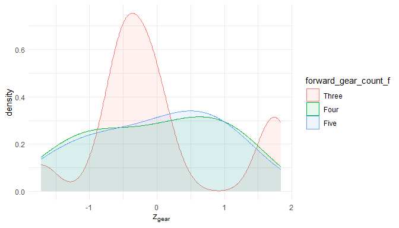

This report covers the analyses used in the ZZZ project (Marcus Mark, PI).

<!--  Set the working directory to the repository's base directory; this assumes the report is nested inside of two directories.-->


<!-- Set the report-wide options, and point to the external code file. -->


<!-- Load 'sourced' R files.  Suppress the output when loading sources. -->


<!-- Load packages, or at least verify they're available on the local machine.  Suppress the output when loading packages. -->


<!-- Load any global functions and variables declared in the R file.  Suppress the output. -->


<!-- Declare any global functions specific to a Rmd output.  Suppress the output. -->


<!-- Load the datasets.   -->


<!-- Tweak the datasets.   -->


Summary {.tabset .tabset-fade .tabset-pills}
===========================================================================

Notes
---------------------------------------------------------------------------

1. The current report covers 32 cars, with 6 unique values for `carburetor_count`.
1. The Seattle track's phluguerstometer was producing flaky negative values; it's measurements have been dropped.


Unanswered Questions
---------------------------------------------------------------------------

1. What does `VS` stand for?  How was it measured?
1. Where the cars at the Philly track measured with the same phluguerstometer and the Cleveland track?


Answered Questions
---------------------------------------------------------------------------

1. The Seattle track's phluguerstometer was producing flaky negative values; it's measurements have been dropped.


Graphs
===========================================================================


Marginals
---------------------------------------------------------------------------

<!-- --><!-- --><!-- --><!-- -->


Scatterplots
---------------------------------------------------------------------------

<!-- --><!-- --><!-- --><!-- --><!-- -->


Models
===========================================================================

Model Exploration
---------------------------------------------------------------------------

```
============= Simple model that's just an intercept. =============
```

```

Call:
lm(formula = quarter_mile_sec ~ 1, data = ds)

Residuals:
    Min      1Q  Median      3Q     Max 
-3.3487 -0.9563 -0.1387  1.0512  5.0512 

Coefficients:
            Estimate Std. Error t value Pr(>|t|)
(Intercept)  17.8488     0.3159    56.5   <2e-16

Residual standard error: 1.787 on 31 degrees of freedom
```

```
============= Model includes one predictor. =============
```

```

Call:
lm(formula = quarter_mile_sec ~ 1 + miles_per_gallon, data = ds)

Residuals:
    Min      1Q  Median      3Q     Max 
-2.8161 -1.0287  0.0954  0.8623  4.7149 

Coefficients:
                 Estimate Std. Error t value Pr(>|t|)
(Intercept)      15.35477    1.02978  14.911 2.05e-15
miles_per_gallon  0.12414    0.04916   2.525   0.0171

Residual standard error: 1.65 on 30 degrees of freedom
Multiple R-squared:  0.1753,	Adjusted R-squared:  0.1478 
F-statistic: 6.377 on 1 and 30 DF,  p-value: 0.01708
```

```
The one predictor is significantly tighter.
```

```
Analysis of Variance Table

Model 1: quarter_mile_sec ~ 1
Model 2: quarter_mile_sec ~ 1 + miles_per_gallon
  Res.Df    RSS Df Sum of Sq      F  Pr(>F)
1     31 98.988                            
2     30 81.636  1    17.352 6.3767 0.01708
```

```
============= Model includes two predictors. =============
```

```

Call:
lm(formula = quarter_mile_sec ~ 1 + miles_per_gallon + forward_gear_count_f, 
    data = ds)

Residuals:
    Min      1Q  Median      3Q     Max 
-2.0370 -0.5882 -0.1602  0.5428  4.1646 

Coefficients:
                         Estimate Std. Error t value Pr(>|t|)
(Intercept)              15.55851    0.89782  17.329  < 2e-16
miles_per_gallon          0.13246    0.05164   2.565 0.015963
forward_gear_count_fFour  0.15680    0.66819   0.235 0.816173
forward_gear_count_fFive -2.75051    0.72888  -3.774 0.000768

Residual standard error: 1.309 on 28 degrees of freedom
Multiple R-squared:  0.5151,	Adjusted R-squared:  0.4632 
F-statistic: 9.916 on 3 and 28 DF,  p-value: 0.0001272
```

```
The two predictor is significantly tighter.
```

```
Analysis of Variance Table

Model 1: quarter_mile_sec ~ 1 + miles_per_gallon
Model 2: quarter_mile_sec ~ 1 + miles_per_gallon + forward_gear_count_f
  Res.Df    RSS Df Sum of Sq      F    Pr(>F)
1     30 81.636                              
2     28 47.996  2     33.64 9.8124 0.0005896
```


Final Model
---------------------------------------------------------------------------


|                         | Estimate| Std. Error| t value| Pr(>&#124;t&#124;)|
|:------------------------|--------:|----------:|-------:|------------------:|
|(Intercept)              |    15.56|       0.90|   17.33|               0.00|
|miles_per_gallon         |     0.13|       0.05|    2.57|               0.02|
|forward_gear_count_fFour |     0.16|       0.67|    0.23|               0.82|
|forward_gear_count_fFive |    -2.75|       0.73|   -3.77|               0.00|

In the model that includes two predictors, the slope coefficent of `Miles per gallon` is 0.13246.


Session Information {#session-info}
===========================================================================

For the sake of documentation and reproducibility, the current report was rendered in the following environment.  Click the line below to expand.

<details>
  <summary>Environment <span class="glyphicon glyphicon-plus-sign"></span></summary>

```
- Session info -----------------------------------------------------------------------
 setting  value                                      
 version  R version 4.0.2 Patched (2020-07-12 r78826)
 os       Windows >= 8 x64                           
 system   x86_64, mingw32                            
 ui       RStudio                                    
 language (EN)                                       
 collate  English_United States.1252                 
 ctype    English_United States.1252                 
 tz       America/Chicago                            
 date     2020-09-29                                 

- Packages ---------------------------------------------------------------------------
 package         * version     date       lib source                                  
 assertthat        0.2.1       2019-03-21 [1] CRAN (R 4.0.0)                          
 backports         1.1.10      2020-09-15 [1] CRAN (R 4.0.2)                          
 bit               4.0.4       2020-08-04 [1] CRAN (R 4.0.2)                          
 bit64             4.0.5       2020-08-30 [1] CRAN (R 4.0.2)                          
 blob              1.2.1       2020-01-20 [1] CRAN (R 4.0.0)                          
 boot              1.3-25      2020-04-26 [3] CRAN (R 4.0.2)                          
 callr             3.4.4       2020-09-07 [1] CRAN (R 4.0.2)                          
 checkmate         2.0.0       2020-02-06 [1] CRAN (R 4.0.0)                          
 cli               2.0.2       2020-02-28 [1] CRAN (R 4.0.0)                          
 colorspace        1.4-1       2019-03-18 [1] CRAN (R 4.0.0)                          
 config            0.3         2018-03-27 [1] CRAN (R 4.0.0)                          
 crayon            1.3.4       2017-09-16 [1] CRAN (R 4.0.0)                          
 curl              4.3         2019-12-02 [1] CRAN (R 4.0.0)                          
 DBI               1.1.0       2019-12-15 [1] CRAN (R 4.0.0)                          
 desc              1.2.0       2018-05-01 [1] CRAN (R 4.0.0)                          
 devtools          2.3.2       2020-09-18 [1] CRAN (R 4.0.2)                          
 digest            0.6.25      2020-02-23 [1] CRAN (R 4.0.0)                          
 dplyr             1.0.2       2020-08-18 [1] CRAN (R 4.0.2)                          
 ellipsis          0.3.1       2020-05-15 [1] CRAN (R 4.0.0)                          
 evaluate          0.14        2019-05-28 [1] CRAN (R 4.0.0)                          
 fansi             0.4.1       2020-01-08 [1] CRAN (R 4.0.0)                          
 farver            2.0.3       2020-01-16 [1] CRAN (R 4.0.0)                          
 forcats           0.5.0       2020-03-01 [1] CRAN (R 4.0.0)                          
 fs                1.5.0       2020-07-31 [1] CRAN (R 4.0.2)                          
 generics          0.0.2       2018-11-29 [1] CRAN (R 4.0.0)                          
 ggplot2         * 3.3.2       2020-06-19 [1] CRAN (R 4.0.2)                          
 glue              1.4.2       2020-08-27 [1] CRAN (R 4.0.2)                          
 gtable            0.3.0       2019-03-25 [1] CRAN (R 4.0.0)                          
 highr             0.8         2019-03-20 [1] CRAN (R 4.0.0)                          
 hms               0.5.3       2020-01-08 [1] CRAN (R 4.0.0)                          
 htmltools         0.5.0       2020-06-16 [1] CRAN (R 4.0.0)                          
 import            1.1.0       2015-06-22 [1] CRAN (R 4.0.0)                          
 knitr           * 1.29        2020-06-23 [1] CRAN (R 4.0.0)                          
 labeling          0.3         2014-08-23 [1] CRAN (R 4.0.0)                          
 lattice           0.20-41     2020-04-02 [3] CRAN (R 4.0.2)                          
 lifecycle         0.2.0       2020-03-06 [1] CRAN (R 4.0.0)                          
 lme4            * 1.1-23      2020-04-07 [1] CRAN (R 4.0.0)                          
 lubridate         1.7.9       2020-06-08 [1] CRAN (R 4.0.0)                          
 magrittr          1.5         2014-11-22 [1] CRAN (R 4.0.0)                          
 MASS              7.3-51.6    2020-04-26 [3] CRAN (R 4.0.2)                          
 Matrix          * 1.2-18      2019-11-27 [3] CRAN (R 4.0.2)                          
 memoise           1.1.0       2017-04-21 [1] CRAN (R 4.0.0)                          
 mgcv              1.8-31      2019-11-09 [3] CRAN (R 4.0.2)                          
 minqa             1.2.4       2014-10-09 [1] CRAN (R 4.0.0)                          
 munsell           0.5.0       2018-06-12 [1] CRAN (R 4.0.0)                          
 nlme              3.1-148     2020-05-24 [3] CRAN (R 4.0.2)                          
 nloptr            1.2.2.2     2020-07-02 [1] CRAN (R 4.0.2)                          
 odbc              1.2.3       2020-06-18 [1] CRAN (R 4.0.0)                          
 OuhscMunge        0.1.9.9013  2020-08-25 [1] Github (OuhscBbmc/OuhscMunge@b8a3663)   
 packrat           0.5.0       2018-11-14 [1] CRAN (R 4.0.0)                          
 pillar            1.4.6       2020-07-10 [1] CRAN (R 4.0.2)                          
 pkgbuild          1.1.0       2020-07-13 [1] CRAN (R 4.0.2)                          
 pkgconfig         2.0.3       2019-09-22 [1] CRAN (R 4.0.0)                          
 pkgload           1.1.0       2020-05-29 [1] CRAN (R 4.0.0)                          
 prettyunits       1.1.1       2020-01-24 [1] CRAN (R 4.0.0)                          
 processx          3.4.4       2020-09-03 [1] CRAN (R 4.0.2)                          
 ps                1.3.4       2020-08-11 [1] CRAN (R 4.0.2)                          
 purrr             0.3.4       2020-04-17 [1] CRAN (R 4.0.0)                          
 R6                2.4.1       2019-11-12 [1] CRAN (R 4.0.0)                          
 Rcpp              1.0.5       2020-07-06 [1] CRAN (R 4.0.2)                          
 readr             1.3.1       2018-12-21 [1] CRAN (R 4.0.0)                          
 remotes           2.2.0       2020-07-21 [1] CRAN (R 4.0.2)                          
 rlang             0.4.7       2020-07-09 [1] CRAN (R 4.0.2)                          
 rmarkdown         2.3         2020-06-18 [1] CRAN (R 4.0.0)                          
 rprojroot         1.3-2       2018-01-03 [1] CRAN (R 4.0.0)                          
 RSQLite           2.2.0       2020-01-07 [1] CRAN (R 4.0.0)                          
 rstudioapi        0.11        2020-02-07 [1] CRAN (R 4.0.0)                          
 scales            1.1.1       2020-05-11 [1] CRAN (R 4.0.0)                          
 sessioninfo       1.1.1       2018-11-05 [1] CRAN (R 4.0.0)                          
 statmod           1.4.34      2020-02-17 [1] CRAN (R 4.0.0)                          
 stringi           1.4.6       2020-02-17 [1] CRAN (R 4.0.0)                          
 stringr           1.4.0       2019-02-10 [1] CRAN (R 4.0.0)                          
 TabularManifest   0.1-16.9003 2020-09-29 [1] Github (Melinae/TabularManifest@b966a2b)
 testit            0.11.1      2020-08-05 [1] Github (yihui/testit@c1c19f8)           
 testthat          2.3.2       2020-03-02 [1] CRAN (R 4.0.0)                          
 tibble            3.0.3       2020-07-10 [1] CRAN (R 4.0.2)                          
 tidyr             1.1.2       2020-08-27 [1] CRAN (R 4.0.2)                          
 tidyselect        1.1.0       2020-05-11 [1] CRAN (R 4.0.0)                          
 usethis           1.6.3       2020-09-17 [1] CRAN (R 4.0.2)                          
 vctrs             0.3.4       2020-08-29 [1] CRAN (R 4.0.2)                          
 viridisLite       0.3.0       2018-02-01 [1] CRAN (R 4.0.0)                          
 withr             2.2.0       2020-04-20 [1] CRAN (R 4.0.0)                          
 xfun              0.16        2020-07-24 [1] CRAN (R 4.0.2)                          
 yaml              2.2.1       2020-02-01 [1] CRAN (R 4.0.0)                          
 zoo               1.8-8       2020-05-02 [1] CRAN (R 4.0.0)                          

[1] D:/Projects/RLibraries
[2] D:/Users/Will/Documents/R/win-library/4.0
[3] C:/Program Files/R/R-4.0.2patched/library
```
</details>


Report rendered by Will at 2020-09-29, 17:54 -0500 in 5 seconds.
