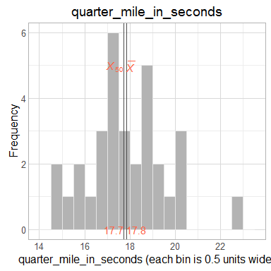
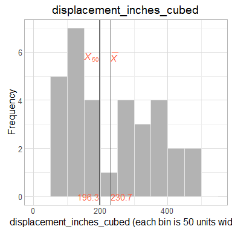
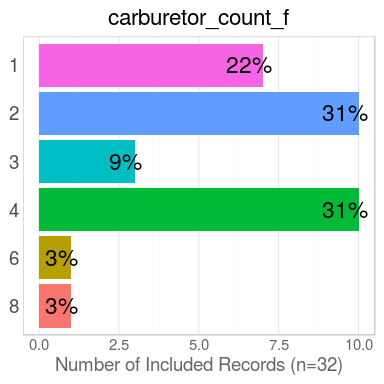
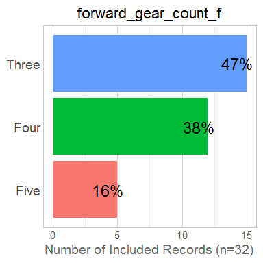
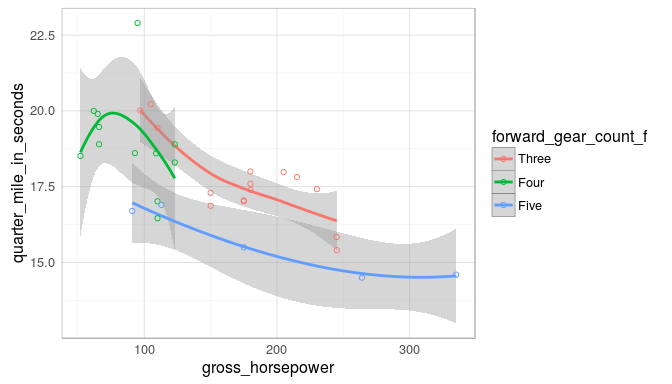
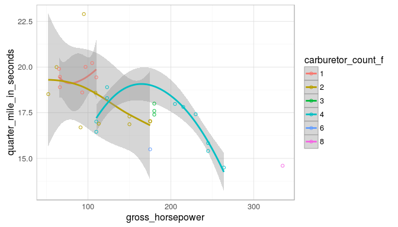
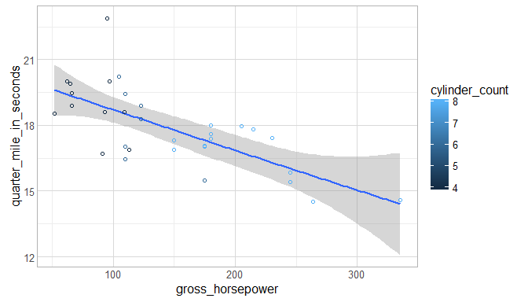

# Skeleton Report 1
Date: `r Sys.Date()`  

This report covers the analyses used in the ZZZ project (Marcus Mark, PI).

<!--  Set the working directory to the repository's base directory; this assumes the report is nested inside of two directories.-->


<!-- Set the report-wide options, and point to the external code file. -->


<!-- Load 'sourced' R files.  Suppress the output when loading sources. --> 


<!-- Load packages, or at least verify they're available on the local machine.  Suppress the output when loading packages. --> 


<!-- Load any global functions and variables declared in the R file.  Suppress the output. --> 


<!-- Declare any global functions specific to a Rmd output.  Suppress the output. --> 


<!-- Load the datasets.   -->


<!-- Tweak the datasets.   -->


# Summary {.tabset .tabset-fade .tabset-pills}

## Notes 
1. The current report covers 32 cars, with 6 unique values for `carburetor_count`.
1. The Seattle track's phluguerstometer was producing flaky negative values; it's measurements have been dropped.

## Unanswered Questions
1. What does `VS` stand for?  How was it measured?
1. Where the cars at the Philly track measured with the same phluguerstometer and the Cleveland track?
 
## Answered Questions
1. The Seattle track's phluguerstometer was producing flaky negative values; it's measurements have been dropped.

# Graphs

## Marginals
<!-- --><!-- --><!-- --><!-- -->

## Scatterplots
<!-- --><!-- --><!-- -->

# Models
## Model Exploration

```
============= Simple model that's just an intercept. =============
```

```

Call:
lm(formula = quarter_mile_in_seconds ~ 1, data = ds)

Residuals:
    Min      1Q  Median      3Q     Max 
-3.3487 -0.9563 -0.1387  1.0512  5.0512 

Coefficients:
            Estimate Std. Error t value Pr(>|t|)
(Intercept)  17.8488     0.3159    56.5   <2e-16

Residual standard error: 1.787 on 31 degrees of freedom
```

```
============= Model includes one predictor. =============
```

```

Call:
lm(formula = quarter_mile_in_seconds ~ 1 + miles_per_gallon, 
    data = ds)

Residuals:
    Min      1Q  Median      3Q     Max 
-2.8161 -1.0287  0.0954  0.8623  4.7149 

Coefficients:
                 Estimate Std. Error t value Pr(>|t|)
(Intercept)      15.35477    1.02978  14.911 2.05e-15
miles_per_gallon  0.12414    0.04916   2.525   0.0171

Residual standard error: 1.65 on 30 degrees of freedom
Multiple R-squared:  0.1753,	Adjusted R-squared:  0.1478 
F-statistic: 6.377 on 1 and 30 DF,  p-value: 0.01708
```

```
The one predictor is significantly tighter.
```

```
Analysis of Variance Table

Model 1: quarter_mile_in_seconds ~ 1
Model 2: quarter_mile_in_seconds ~ 1 + miles_per_gallon
  Res.Df    RSS Df Sum of Sq      F  Pr(>F)
1     31 98.988                            
2     30 81.636  1    17.352 6.3767 0.01708
```

```
============= Model includes two predictors. =============
```

```

Call:
lm(formula = quarter_mile_in_seconds ~ 1 + miles_per_gallon + 
    forward_gear_count_f, data = ds)

Residuals:
    Min      1Q  Median      3Q     Max 
-2.0370 -0.5882 -0.1602  0.5428  4.1646 

Coefficients:
                         Estimate Std. Error t value Pr(>|t|)
(Intercept)              15.55851    0.89782  17.329  < 2e-16
miles_per_gallon          0.13246    0.05164   2.565 0.015963
forward_gear_count_fFour  0.15680    0.66819   0.235 0.816173
forward_gear_count_fFive -2.75051    0.72888  -3.774 0.000768

Residual standard error: 1.309 on 28 degrees of freedom
Multiple R-squared:  0.5151,	Adjusted R-squared:  0.4632 
F-statistic: 9.916 on 3 and 28 DF,  p-value: 0.0001272
```

```
The two predictor is significantly tighter.
```

```
Analysis of Variance Table

Model 1: quarter_mile_in_seconds ~ 1 + miles_per_gallon
Model 2: quarter_mile_in_seconds ~ 1 + miles_per_gallon + forward_gear_count_f
  Res.Df    RSS Df Sum of Sq      F    Pr(>F)
1     30 81.636                              
2     28 47.996  2     33.64 9.8124 0.0005896
```

## Final Model

|                         | Estimate| Std. Error| t value| Pr(>&#124;t&#124;)|
|:------------------------|--------:|----------:|-------:|------------------:|
|(Intercept)              |    15.56|       0.90|   17.33|               0.00|
|miles_per_gallon         |     0.13|       0.05|    2.57|               0.02|
|forward_gear_count_fFour |     0.16|       0.67|    0.23|               0.82|
|forward_gear_count_fFive |    -2.75|       0.73|   -3.77|               0.00|

In the model that includes two predictors, the slope coefficent of `Miles per gallon` is 0.13246.


# Session Information
For the sake of documentation and reproducibility, the current report was rendered in the following environment.  Click the line below to expand.

<details>
  <summary>Environment <span class="glyphicon glyphicon-plus-sign"></span></summary>

```
Session info ---------------------------------------------------------------------------------------
```

```
 setting  value                       
 version  R version 3.3.1 (2016-06-21)
 system   x86_64, linux-gnu           
 ui       X11                         
 language en_US                       
 collate  en_US.UTF-8                 
 tz       America/Chicago             
 date     2017-03-18                  
```

```
Packages -------------------------------------------------------------------------------------------
```

```
 package    * version    date       source                       
 assertthat   0.1        2013-12-06 CRAN (R 3.3.0)               
 backports    1.0.5      2017-01-18 CRAN (R 3.3.1)               
 bindr        0.1        2016-11-13 cran (@0.1)                  
 bindrcpp   * 0.1        2016-12-11 cran (@0.1)                  
 colorspace   1.3-2      2016-12-14 CRAN (R 3.3.1)               
 DBI          0.6        2017-03-09 CRAN (R 3.3.1)               
 devtools     1.12.0     2016-06-24 CRAN (R 3.3.1)               
 digest       0.6.12     2017-01-27 CRAN (R 3.3.1)               
 dplyr        0.5.0.9000 2017-02-24 Github (hadley/dplyr@8bf5a99)
 evaluate     0.10       2016-10-11 CRAN (R 3.3.1)               
 ggplot2    * 2.2.1      2016-12-30 CRAN (R 3.3.1)               
 gtable       0.2.0      2016-02-26 CRAN (R 3.3.0)               
 highr        0.6        2016-05-09 CRAN (R 3.3.0)               
 htmltools    0.3.5      2016-03-21 CRAN (R 3.3.0)               
 knitr      * 1.15.1     2016-11-22 CRAN (R 3.3.1)               
 labeling     0.3        2014-08-23 CRAN (R 3.3.0)               
 lazyeval     0.2.0      2016-06-12 CRAN (R 3.3.0)               
 magrittr   * 1.5        2014-11-22 CRAN (R 3.3.0)               
 memoise      1.0.0      2016-01-29 CRAN (R 3.3.0)               
 munsell      0.4.3      2016-02-13 CRAN (R 3.3.0)               
 plyr         1.8.4      2016-06-08 CRAN (R 3.3.0)               
 R6           2.2.0      2016-10-05 CRAN (R 3.3.1)               
 Rcpp         0.12.9     2017-01-14 CRAN (R 3.3.1)               
 readr        1.0.0      2016-08-03 CRAN (R 3.3.1)               
 rmarkdown    1.3        2016-12-21 CRAN (R 3.3.1)               
 rprojroot    1.2        2017-01-16 CRAN (R 3.3.1)               
 scales       0.4.1      2016-11-09 CRAN (R 3.3.1)               
 stringi      1.1.2      2016-10-01 CRAN (R 3.3.1)               
 stringr      1.2.0      2017-02-18 CRAN (R 3.3.1)               
 tibble       1.2        2016-08-26 CRAN (R 3.3.1)               
 withr        1.0.2      2016-06-20 CRAN (R 3.3.0)               
 yaml         2.1.14     2016-11-12 CRAN (R 3.3.1)               
```
</details>


Report rendered by wibeasley at 2017-03-18, 00:32 -0500 in 4 seconds.

