This report covers the analyses used in the ZZZ project (Marcus Mark, PI).

<!--  Set the working directory to the repository's base directory; this assumes the report is nested inside of two directories.-->


<!-- Set the report-wide options, and point to the external code file. -->


<!-- Load 'sourced' R files.  Suppress the output when loading sources. -->


<!-- Load packages, or at least verify they're available on the local machine.  Suppress the output when loading packages. -->


<!-- Load any global functions and variables declared in the R file.  Suppress the output. -->


<!-- Declare any global functions specific to a Rmd output.  Suppress the output. -->


<!-- Load the datasets.   -->


<!-- Tweak the datasets.   -->


Summary {.tabset .tabset-fade .tabset-pills}
===========================================================================

Notes
---------------------------------------------------------------------------

1. The current report covers 3080 county-months, with 77 unique values for `county_id`.
1. The Seattle track's phluguerstometer was producing flaky negative values; it's measurements have been dropped.


Unanswered Questions
---------------------------------------------------------------------------

1. What does `VS` stand for?  How was it measured?
1. Where the cars at the Philly track measured with the same phluguerstometer and the Cleveland track?


Answered Questions
---------------------------------------------------------------------------

1. The Seattle track's phluguerstometer was producing flaky negative values; it's measurements have been dropped.


Graphs
===========================================================================
Especially for the histograms, don't feel like each graph should be profound.
Boring sanity checks are useful,
such as the histogram of county names,
verifies there are ~77 different values (although they're mostly unreadable).


Marginals County
---------------------------------------------------------------------------

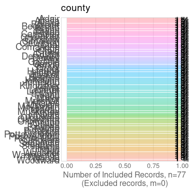<!-- -->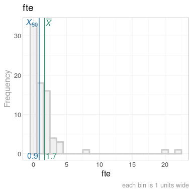<!-- -->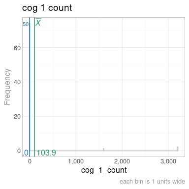<!-- -->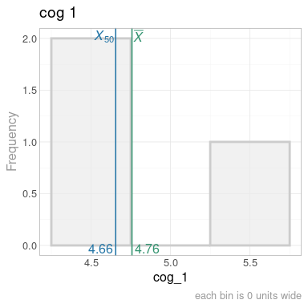<!-- -->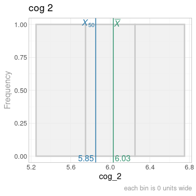<!-- -->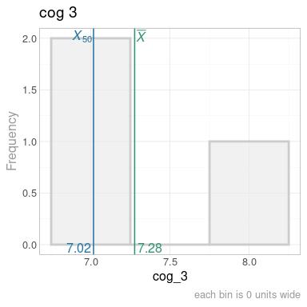<!-- -->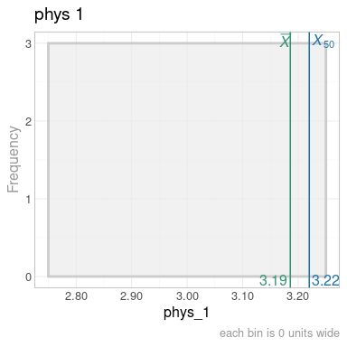<!-- -->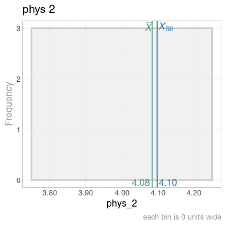<!-- -->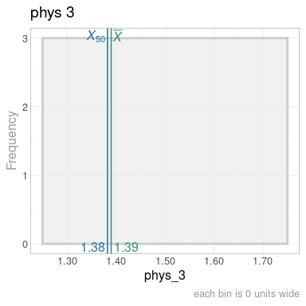<!-- -->

Marginals County-Month
---------------------------------------------------------------------------

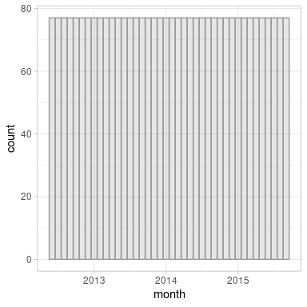<!-- -->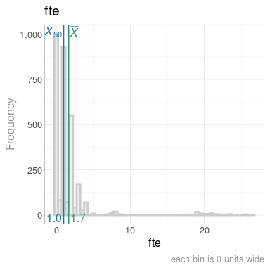<!-- -->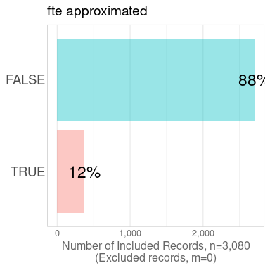<!-- -->


Scatterplots
---------------------------------------------------------------------------

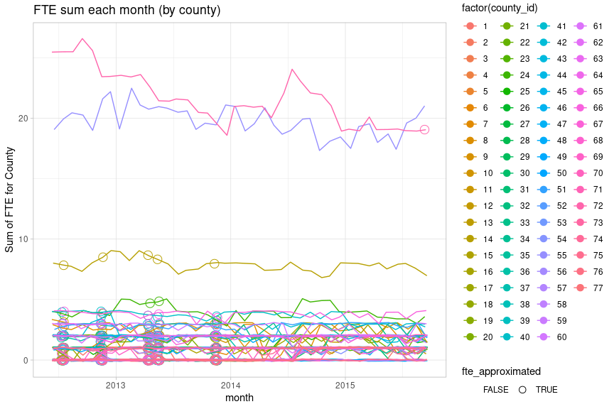<!-- -->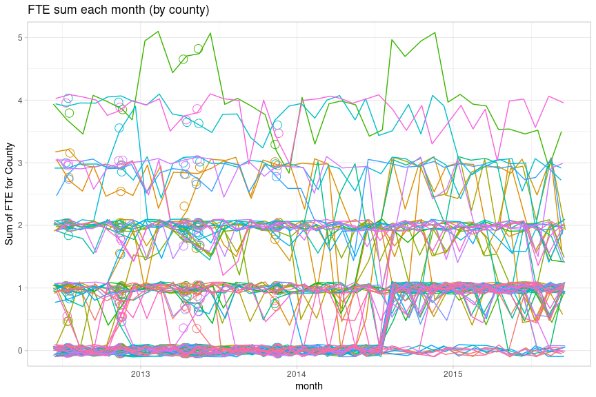<!-- -->

```
<ggplot2::labels> List of 2
 $ y    : chr "Sum of FTE for County"
 $ title: chr "Zoomed: FTE sum each month (by county)"
```


Models
===========================================================================

Model Exploration
---------------------------------------------------------------------------

```
============= Simple model that's just an intercept. =============
```

```

Call:
lm(formula = fte ~ 1, data = ds_county_month)

Residuals:
    Min      1Q  Median      3Q     Max 
-1.6801 -1.6801 -0.6801  0.3199 24.8199 

Coefficients:
            Estimate Std. Error t value Pr(>|t|)
(Intercept)  1.68012    0.06074   27.66   <2e-16

Residual standard error: 3.371 on 3079 degrees of freedom
```

```
============= Model includes one predictor (ie, month). =============
```

```

Call:
lm(formula = fte ~ 1 + month, data = ds_county_month)

Residuals:
    Min      1Q  Median      3Q     Max 
-1.7997 -1.5990 -0.7322  0.2863 24.9208 

Coefficients:
              Estimate Std. Error t value Pr(>|t|)
(Intercept) -1.5619680  2.7859569  -0.561    0.575
month        0.0002014  0.0001730   1.164    0.245

Residual standard error: 3.371 on 3078 degrees of freedom
Multiple R-squared:  0.00044,	Adjusted R-squared:  0.0001153 
F-statistic: 1.355 on 1 and 3078 DF,  p-value: 0.2445
```

```
The one predictor is NOT significantly tighter.
```

```
Analysis of Variance Table

Model 1: fte ~ 1
Model 2: fte ~ 1 + month
  Res.Df   RSS Df Sum of Sq      F Pr(>F)
1   3079 34989                           
2   3078 34974  1    15.395 1.3549 0.2445
```

```
============= MLM for county. =============
```

```
Linear mixed model fit by REML ['lmerMod']
Formula: fte ~ 1 + (1 | county)
   Data: ds_county_month

REML criterion at convergence: 5210.2

Scaled residuals: 
    Min      1Q  Median      3Q     Max 
-5.9382 -0.6584 -0.0019  0.4365  9.6331 

Random effects:
 Groups   Name        Variance Std.Dev.
 county   (Intercept) 11.242   3.3530  
 Residual              0.264   0.5138  
Number of obs: 3080, groups:  county, 77

Fixed effects:
            Estimate Std. Error t value
(Intercept)   1.6801     0.3822   4.396
```

```
============= MLM adds month. =============
```

```
Linear mixed model fit by REML ['lmerMod']
Formula: fte ~ 1 + month + (1 | county)
   Data: ds_county_month

REML criterion at convergence: 5170.6

Scaled residuals: 
    Min      1Q  Median      3Q     Max 
-5.9782 -0.5621 -0.0094  0.4683  9.9245 

Random effects:
 Groups   Name        Variance Std.Dev.
 county   (Intercept) 11.2424  3.3530  
 Residual              0.2589  0.5088  
Number of obs: 3080, groups:  county, 77

Fixed effects:
              Estimate Std. Error t value
(Intercept) -1.562e+00  5.682e-01  -2.749
month        2.014e-04  2.612e-05   7.711

Correlation of Fixed Effects:
      (Intr)
month -0.740
```

```
Including the Month predictor in the MLM is significantly tighter.
```

```
Data: ds_county_month
Models:
m2: fte ~ 1 + (1 | county)
m3: fte ~ 1 + month + (1 | county)
   npar    AIC    BIC  logLik -2*log(L)  Chisq Df Pr(>Chisq)
m2    3 5216.1 5234.2 -2605.1    5210.1                     
m3    4 5159.2 5183.3 -2575.6    5151.2 58.899  1   1.66e-14
```


Final Model
---------------------------------------------------------------------------


|            | Estimate| Std. Error| t value|
|:-----------|--------:|----------:|-------:|
|(Intercept) |    -1.56|       0.57|   -2.75|
|month       |     0.00|       0.00|    7.71|

In the MLM that includes time, the slope coefficent of `month` is 2.013797\times 10^{-4}.


Session Information {#session-info}
===========================================================================

For the sake of documentation and reproducibility, the current report was rendered in the following environment.  Click the line below to expand.

<details>
  <summary>Environment <span class="glyphicon glyphicon-plus-sign"></span></summary>

```
─ Session info ───────────────────────────────────────────────────────────────────────────────────
 setting  value
 version  R version 4.5.3 (2026-03-11)
 os       Ubuntu 22.04.5 LTS
 system   x86_64, linux-gnu
 ui       RStudio
 language (EN)
 collate  en_US.UTF-8
 ctype    en_US.UTF-8
 tz       America/Chicago
 date     2026-04-18
 rstudio  2026.01.1+403 Apple Blossom (desktop)
 pandoc   3.6.3 @ /usr/lib/rstudio/resources/app/bin/quarto/bin/tools/x86_64/ (via rmarkdown)
 quarto   1.5.57 @ /usr/local/bin/quarto

─ Packages ───────────────────────────────────────────────────────────────────────────────────────
 package           * version    date (UTC) lib source
 arrow               23.0.1.2   2026-03-25 [1] CRAN (R 4.5.3)
 assertthat          0.2.1      2019-03-21 [1] CRAN (R 4.5.3)
 backports           1.5.0      2024-05-23 [1] CRAN (R 4.5.0)
 base              * 4.5.3      2026-03-14 [4] local
 bit                 4.6.0      2025-03-06 [1] CRAN (R 4.5.0)
 bit64               4.6.0-1    2025-01-16 [1] CRAN (R 4.5.0)
 blob                1.3.0      2026-01-14 [1] CRAN (R 4.5.2)
 boot                1.3-32     2025-08-29 [1] CRAN (R 4.5.1)
 bslib               0.10.0     2026-01-26 [1] CRAN (R 4.5.2)
 cachem              1.1.0      2024-05-16 [1] CRAN (R 4.5.0)
 callr               3.7.6      2024-03-25 [1] CRAN (R 4.5.0)
 checkmate           2.3.4      2026-02-03 [1] CRAN (R 4.5.2)
 cli                 3.6.5      2025-04-23 [1] CRAN (R 4.5.0)
 compiler            4.5.3      2026-03-14 [4] local
 config              0.3.2      2023-08-30 [1] CRAN (R 4.5.0)
 corrplot            0.95       2024-10-14 [1] CRAN (R 4.5.3)
 crayon              1.5.3      2024-06-20 [1] CRAN (R 4.5.0)
 curl                7.0.0      2025-08-19 [1] CRAN (R 4.5.1)
 datasets          * 4.5.3      2026-03-14 [4] local
 DBI                 1.3.0      2026-02-25 [1] CRAN (R 4.5.2)
 desc                1.4.3      2023-12-10 [1] CRAN (R 4.5.0)
 digest              0.6.39     2025-11-19 [1] CRAN (R 4.5.2)
 dplyr               1.2.0      2026-02-03 [1] CRAN (R 4.5.2)
 evaluate            1.0.5      2025-08-27 [1] CRAN (R 4.5.1)
 farver              2.1.2      2024-05-13 [1] CRAN (R 4.5.0)
 fastmap             1.2.0      2024-05-15 [1] CRAN (R 4.5.0)
 flexdashboard     * 0.6.3      2026-01-28 [1] CRAN (R 4.5.3)
 forcats             1.0.1      2025-09-25 [1] CRAN (R 4.5.3)
 fs                  1.6.7      2026-03-06 [1] CRAN (R 4.5.2)
 generics            0.1.4      2025-05-09 [1] CRAN (R 4.5.1)
 ggplot2           * 4.0.2      2026-02-03 [1] CRAN (R 4.5.2)
 glue                1.8.0      2024-09-30 [1] CRAN (R 4.5.0)
 graphics          * 4.5.3      2026-03-14 [4] local
 grDevices         * 4.5.3      2026-03-14 [4] local
 grid                4.5.3      2026-03-14 [4] local
 gtable              0.3.6      2024-10-25 [1] CRAN (R 4.5.0)
 hms                 1.1.4      2025-10-17 [1] CRAN (R 4.5.2)
 htmltools           0.5.9      2025-12-04 [1] CRAN (R 4.5.2)
 import              1.3.4      2025-10-19 [1] CRAN (R 4.5.2)
 jquerylib           0.1.4      2021-04-26 [1] CRAN (R 4.5.0)
 jsonlite            2.0.0      2025-03-27 [1] CRAN (R 4.5.0)
 knitr             * 1.51       2025-12-20 [1] CRAN (R 4.5.2)
 labeling            0.4.3      2023-08-29 [1] CRAN (R 4.5.0)
 lattice             0.22-9     2026-02-09 [1] CRAN (R 4.5.2)
 lifecycle           1.0.5      2026-01-08 [1] CRAN (R 4.5.2)
 lme4              * 2.0-1      2026-03-05 [1] CRAN (R 4.5.2)
 lubridate           1.9.5      2026-02-04 [1] CRAN (R 4.5.2)
 magrittr            2.0.4      2025-09-12 [1] CRAN (R 4.5.1)
 MASS                7.3-65     2025-02-28 [1] CRAN (R 4.5.0)
 Matrix            * 1.7-4      2025-08-28 [1] CRAN (R 4.5.1)
 memoise             2.0.1      2021-11-26 [1] CRAN (R 4.5.0)
 methods           * 4.5.3      2026-03-14 [4] local
 mgcv                1.9-4      2025-11-07 [1] CRAN (R 4.5.2)
 minqa               1.2.8      2024-08-17 [1] CRAN (R 4.5.0)
 nlme                3.1-168    2025-03-31 [1] CRAN (R 4.5.0)
 nloptr              2.2.1      2025-03-17 [1] CRAN (R 4.5.0)
 odbc                1.6.4.1    2025-12-24 [1] CRAN (R 4.5.2)
 otel                0.2.0      2025-08-29 [1] CRAN (R 4.5.2)
 OuhscMunge          1.0.1.9000 2025-04-25 [1] Github (OuhscBbmc/OuhscMunge@5da3270)
 parallel            4.5.3      2026-03-14 [4] local
 pillar              1.11.1     2025-09-17 [1] CRAN (R 4.5.1)
 pkgbuild            1.4.8      2025-05-26 [1] CRAN (R 4.5.1)
 pkgconfig           2.0.3      2019-09-22 [1] CRAN (R 4.5.0)
 processx            3.8.6      2025-02-21 [1] CRAN (R 4.5.0)
 ps                  1.9.1      2025-04-12 [1] CRAN (R 4.5.0)
 purrr               1.2.1      2026-01-09 [1] CRAN (R 4.5.2)
 R6                  2.6.1      2025-02-15 [1] CRAN (R 4.5.0)
 RAnalysisSkeleton * 1.0.0      2026-04-18 [1] local
 rbibutils           2.4.1      2026-01-21 [1] CRAN (R 4.5.2)
 RColorBrewer        1.1-3      2022-04-03 [1] CRAN (R 4.5.0)
 Rcpp                1.1.1      2026-01-10 [1] CRAN (R 4.5.2)
 Rdpack              2.6.6      2026-02-08 [1] CRAN (R 4.5.2)
 readr               2.2.0      2026-02-19 [1] CRAN (R 4.5.2)
 reformulas          0.4.4      2026-02-02 [1] CRAN (R 4.5.2)
 remotes             2.5.0      2024-03-17 [1] CRAN (R 4.5.0)
 rlang               1.1.7      2026-01-09 [1] CRAN (R 4.5.2)
 rmarkdown           2.30       2025-09-28 [1] CRAN (R 4.5.2)
 RSQLite             2.4.6      2026-02-06 [1] CRAN (R 4.5.2)
 rstudioapi          0.18.0     2026-01-16 [1] CRAN (R 4.5.2)
 S7                  0.2.1      2025-11-14 [1] CRAN (R 4.5.2)
 sass                0.4.10     2025-04-11 [1] CRAN (R 4.5.0)
 scales              1.4.0      2025-04-24 [1] CRAN (R 4.5.0)
 sessioninfo         1.2.3      2025-02-05 [1] CRAN (R 4.5.0)
 splines             4.5.3      2026-03-14 [4] local
 stats             * 4.5.3      2026-03-14 [4] local
 TabularManifest     0.2.1      2026-04-18 [1] Github (Melinae/TabularManifest@3c80a34)
 testit              0.17       2026-03-06 [1] CRAN (R 4.5.2)
 tibble              3.3.1      2026-01-11 [1] CRAN (R 4.5.2)
 tidyr               1.3.2      2025-12-19 [1] CRAN (R 4.5.2)
 tidyselect          1.2.1      2024-03-11 [1] CRAN (R 4.5.0)
 timechange          0.4.0      2026-01-29 [1] CRAN (R 4.5.2)
 tools               4.5.3      2026-03-14 [4] local
 tzdb                0.5.0      2025-03-15 [1] CRAN (R 4.5.0)
 utf8                1.2.6      2025-06-08 [1] CRAN (R 4.5.1)
 utils             * 4.5.3      2026-03-14 [4] local
 vctrs               0.7.1      2026-01-23 [1] CRAN (R 4.5.2)
 viridisLite         0.4.3      2026-02-04 [1] CRAN (R 4.5.2)
 vroom               1.7.0      2026-01-27 [1] CRAN (R 4.5.2)
 withr               3.0.2      2024-10-28 [1] CRAN (R 4.5.0)
 xfun                0.56       2026-01-18 [1] CRAN (R 4.5.2)
 yaml                2.3.12     2025-12-10 [1] CRAN (R 4.5.2)
 zoo                 1.8-15     2025-12-15 [1] CRAN (R 4.5.2)

 [1] /home/wibeasley/R/x86_64-pc-linux-gnu-library/4.5
 [2] /usr/local/lib/R/site-library
 [3] /usr/lib/R/site-library
 [4] /usr/lib/R/library
 * ── Packages attached to the search path.

──────────────────────────────────────────────────────────────────────────────────────────────────
```
</details>


Report rendered by wibeasley at 2026-04-18, 18:40 -0500 in 14 seconds.
