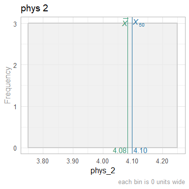

This report covers the analyses used in the ZZZ project (Marcus Mark, PI).

<!--  Set the working directory to the repository's base directory; this assumes the report is nested inside of two directories.-->


<!-- Set the report-wide options, and point to the external code file. -->


<!-- Load 'sourced' R files.  Suppress the output when loading sources. -->


<!-- Load packages, or at least verify they're available on the local machine.  Suppress the output when loading packages. -->


<!-- Load any global functions and variables declared in the R file.  Suppress the output. -->


<!-- Declare any global functions specific to a Rmd output.  Suppress the output. -->


<!-- Load the datasets.   -->


<!-- Tweak the datasets.   -->


Summary {.tabset .tabset-fade .tabset-pills}
===========================================================================

Notes
---------------------------------------------------------------------------

1. The current report covers 3080 county-months, with 77 unique values for `county_id`.
1. The Seattle track's phluguerstometer was producing flaky negative values; it's measurements have been dropped.


Unanswered Questions
---------------------------------------------------------------------------

1. What does `VS` stand for?  How was it measured?
1. Where the cars at the Philly track measured with the same phluguerstometer and the Cleveland track?


Answered Questions
---------------------------------------------------------------------------

1. The Seattle track's phluguerstometer was producing flaky negative values; it's measurements have been dropped.


Graphs
===========================================================================
Especially for the histograms, don't feel like each graph should be profound.
Boring sanity checks are useful,
such as the histogram of county names,
verifies there are ~77 different values (although they're mostly unreadable).


Marginals County
---------------------------------------------------------------------------

<!-- --><!-- --><!-- --><!-- --><!-- --><!-- --><!-- --><!-- --><!-- -->

Marginals County-Month
---------------------------------------------------------------------------

<!-- --><!-- --><!-- -->


Scatterplots
---------------------------------------------------------------------------

<!-- --><!-- -->

```
$y
[1] "Sum of FTE for County"

$title
[1] "Zoomed: FTE sum each month (by county)"

attr(,"class")
[1] "labels"
```


Models
===========================================================================

Model Exploration
---------------------------------------------------------------------------

```
============= Simple model that's just an intercept. =============
```

```

Call:
lm(formula = fte ~ 1, data = ds_county_month)

Residuals:
    Min      1Q  Median      3Q     Max 
-1.6801 -1.6801 -0.6801  0.3199 24.8199 

Coefficients:
            Estimate Std. Error t value Pr(>|t|)
(Intercept)  1.68012    0.06074   27.66   <2e-16

Residual standard error: 3.371 on 3079 degrees of freedom
```

```
============= Model includes one predictor (ie, month). =============
```

```

Call:
lm(formula = fte ~ 1 + month, data = ds_county_month)

Residuals:
    Min      1Q  Median      3Q     Max 
-1.7997 -1.5990 -0.7322  0.2863 24.9208 

Coefficients:
              Estimate Std. Error t value Pr(>|t|)
(Intercept) -1.5619680  2.7859569  -0.561    0.575
month        0.0002014  0.0001730   1.164    0.245

Residual standard error: 3.371 on 3078 degrees of freedom
Multiple R-squared:  0.00044,	Adjusted R-squared:  0.0001153 
F-statistic: 1.355 on 1 and 3078 DF,  p-value: 0.2445
```

```
The one predictor is NOT significantly tighter.
```

```
Analysis of Variance Table

Model 1: fte ~ 1
Model 2: fte ~ 1 + month
  Res.Df   RSS Df Sum of Sq      F Pr(>F)
1   3079 34989                           
2   3078 34974  1    15.395 1.3549 0.2445
```

```
============= MLM for county. =============
```

```
Linear mixed model fit by REML ['lmerMod']
Formula: fte ~ 1 + (1 | county)
   Data: ds_county_month

REML criterion at convergence: 5210.2

Scaled residuals: 
    Min      1Q  Median      3Q     Max 
-5.9382 -0.6584 -0.0019  0.4365  9.6331 

Random effects:
 Groups   Name        Variance Std.Dev.
 county   (Intercept) 11.242   3.3530  
 Residual              0.264   0.5138  
Number of obs: 3080, groups:  county, 77

Fixed effects:
            Estimate Std. Error t value
(Intercept)   1.6801     0.3822   4.396
```

```
============= MLM adds month. =============
```

```
Linear mixed model fit by REML ['lmerMod']
Formula: fte ~ 1 + month + (1 | county)
   Data: ds_county_month

REML criterion at convergence: 5170.6

Scaled residuals: 
    Min      1Q  Median      3Q     Max 
-5.9782 -0.5621 -0.0094  0.4683  9.9245 

Random effects:
 Groups   Name        Variance Std.Dev.
 county   (Intercept) 11.2424  3.3530  
 Residual              0.2589  0.5088  
Number of obs: 3080, groups:  county, 77

Fixed effects:
              Estimate Std. Error t value
(Intercept) -1.562e+00  5.682e-01  -2.749
month        2.014e-04  2.612e-05   7.711

Correlation of Fixed Effects:
      (Intr)
month -0.740
```

```
Including the Month predictor in the MLM is significantly tighter.
```

```
Data: ds_county_month
Models:
m2: fte ~ 1 + (1 | county)
m3: fte ~ 1 + month + (1 | county)
   npar    AIC    BIC  logLik deviance  Chisq Df Pr(>Chisq)
m2    3 5216.1 5234.2 -2605.1   5210.1                     
m3    4 5159.2 5183.3 -2575.6   5151.2 58.899  1   1.66e-14
```


Final Model
---------------------------------------------------------------------------


|            | Estimate| Std. Error| t value|
|:-----------|--------:|----------:|-------:|
|(Intercept) |    -1.56|       0.57|   -2.75|
|month       |     0.00|       0.00|    7.71|

In the MLM that includes time, the slope coefficent of `month` is 2.013797\times 10^{-4}.


Session Information {#session-info}
===========================================================================

For the sake of documentation and reproducibility, the current report was rendered in the following environment.  Click the line below to expand.

<details>
  <summary>Environment <span class="glyphicon glyphicon-plus-sign"></span></summary>

```
- Session info -----------------------------------------------------------------------
 setting  value                                      
 version  R version 4.0.2 Patched (2020-07-12 r78826)
 os       Windows >= 8 x64                           
 system   x86_64, mingw32                            
 ui       RStudio                                    
 language (EN)                                       
 collate  English_United States.1252                 
 ctype    English_United States.1252                 
 tz       America/Chicago                            
 date     2020-09-29                                 

- Packages ---------------------------------------------------------------------------
 package         * version     date       lib source                                  
 assertthat        0.2.1       2019-03-21 [1] CRAN (R 4.0.0)                          
 backports         1.1.10      2020-09-15 [1] CRAN (R 4.0.2)                          
 bit               4.0.4       2020-08-04 [1] CRAN (R 4.0.2)                          
 bit64             4.0.5       2020-08-30 [1] CRAN (R 4.0.2)                          
 blob              1.2.1       2020-01-20 [1] CRAN (R 4.0.0)                          
 boot              1.3-25      2020-04-26 [3] CRAN (R 4.0.2)                          
 callr             3.4.4       2020-09-07 [1] CRAN (R 4.0.2)                          
 checkmate         2.0.0       2020-02-06 [1] CRAN (R 4.0.0)                          
 cli               2.0.2       2020-02-28 [1] CRAN (R 4.0.0)                          
 colorspace        1.4-1       2019-03-18 [1] CRAN (R 4.0.0)                          
 config            0.3         2018-03-27 [1] CRAN (R 4.0.0)                          
 crayon            1.3.4       2017-09-16 [1] CRAN (R 4.0.0)                          
 curl              4.3         2019-12-02 [1] CRAN (R 4.0.0)                          
 DBI               1.1.0       2019-12-15 [1] CRAN (R 4.0.0)                          
 desc              1.2.0       2018-05-01 [1] CRAN (R 4.0.0)                          
 devtools          2.3.2       2020-09-18 [1] CRAN (R 4.0.2)                          
 digest            0.6.25      2020-02-23 [1] CRAN (R 4.0.0)                          
 dplyr             1.0.2       2020-08-18 [1] CRAN (R 4.0.2)                          
 ellipsis          0.3.1       2020-05-15 [1] CRAN (R 4.0.0)                          
 evaluate          0.14        2019-05-28 [1] CRAN (R 4.0.0)                          
 fansi             0.4.1       2020-01-08 [1] CRAN (R 4.0.0)                          
 farver            2.0.3       2020-01-16 [1] CRAN (R 4.0.0)                          
 forcats           0.5.0       2020-03-01 [1] CRAN (R 4.0.0)                          
 fs                1.5.0       2020-07-31 [1] CRAN (R 4.0.2)                          
 generics          0.0.2       2018-11-29 [1] CRAN (R 4.0.0)                          
 ggplot2         * 3.3.2       2020-06-19 [1] CRAN (R 4.0.2)                          
 glue              1.4.2       2020-08-27 [1] CRAN (R 4.0.2)                          
 gtable            0.3.0       2019-03-25 [1] CRAN (R 4.0.0)                          
 highr             0.8         2019-03-20 [1] CRAN (R 4.0.0)                          
 hms               0.5.3       2020-01-08 [1] CRAN (R 4.0.0)                          
 htmltools         0.5.0       2020-06-16 [1] CRAN (R 4.0.0)                          
 import            1.1.0       2015-06-22 [1] CRAN (R 4.0.0)                          
 knitr           * 1.29        2020-06-23 [1] CRAN (R 4.0.0)                          
 labeling          0.3         2014-08-23 [1] CRAN (R 4.0.0)                          
 lattice           0.20-41     2020-04-02 [3] CRAN (R 4.0.2)                          
 lifecycle         0.2.0       2020-03-06 [1] CRAN (R 4.0.0)                          
 lme4            * 1.1-23      2020-04-07 [1] CRAN (R 4.0.0)                          
 lubridate         1.7.9       2020-06-08 [1] CRAN (R 4.0.0)                          
 magrittr          1.5         2014-11-22 [1] CRAN (R 4.0.0)                          
 MASS              7.3-51.6    2020-04-26 [3] CRAN (R 4.0.2)                          
 Matrix          * 1.2-18      2019-11-27 [3] CRAN (R 4.0.2)                          
 memoise           1.1.0       2017-04-21 [1] CRAN (R 4.0.0)                          
 mgcv              1.8-31      2019-11-09 [3] CRAN (R 4.0.2)                          
 minqa             1.2.4       2014-10-09 [1] CRAN (R 4.0.0)                          
 munsell           0.5.0       2018-06-12 [1] CRAN (R 4.0.0)                          
 nlme              3.1-148     2020-05-24 [3] CRAN (R 4.0.2)                          
 nloptr            1.2.2.2     2020-07-02 [1] CRAN (R 4.0.2)                          
 odbc              1.2.3       2020-06-18 [1] CRAN (R 4.0.0)                          
 OuhscMunge        0.1.9.9013  2020-08-25 [1] Github (OuhscBbmc/OuhscMunge@b8a3663)   
 packrat           0.5.0       2018-11-14 [1] CRAN (R 4.0.0)                          
 pillar            1.4.6       2020-07-10 [1] CRAN (R 4.0.2)                          
 pkgbuild          1.1.0       2020-07-13 [1] CRAN (R 4.0.2)                          
 pkgconfig         2.0.3       2019-09-22 [1] CRAN (R 4.0.0)                          
 pkgload           1.1.0       2020-05-29 [1] CRAN (R 4.0.0)                          
 prettyunits       1.1.1       2020-01-24 [1] CRAN (R 4.0.0)                          
 processx          3.4.4       2020-09-03 [1] CRAN (R 4.0.2)                          
 ps                1.3.4       2020-08-11 [1] CRAN (R 4.0.2)                          
 purrr             0.3.4       2020-04-17 [1] CRAN (R 4.0.0)                          
 R6                2.4.1       2019-11-12 [1] CRAN (R 4.0.0)                          
 Rcpp              1.0.5       2020-07-06 [1] CRAN (R 4.0.2)                          
 readr             1.3.1       2018-12-21 [1] CRAN (R 4.0.0)                          
 remotes           2.2.0       2020-07-21 [1] CRAN (R 4.0.2)                          
 rlang             0.4.7       2020-07-09 [1] CRAN (R 4.0.2)                          
 rmarkdown         2.3         2020-06-18 [1] CRAN (R 4.0.0)                          
 rprojroot         1.3-2       2018-01-03 [1] CRAN (R 4.0.0)                          
 RSQLite           2.2.0       2020-01-07 [1] CRAN (R 4.0.0)                          
 rstudioapi        0.11        2020-02-07 [1] CRAN (R 4.0.0)                          
 scales            1.1.1       2020-05-11 [1] CRAN (R 4.0.0)                          
 sessioninfo       1.1.1       2018-11-05 [1] CRAN (R 4.0.0)                          
 statmod           1.4.34      2020-02-17 [1] CRAN (R 4.0.0)                          
 stringi           1.4.6       2020-02-17 [1] CRAN (R 4.0.0)                          
 stringr           1.4.0       2019-02-10 [1] CRAN (R 4.0.0)                          
 TabularManifest   0.1-16.9003 2020-09-29 [1] Github (Melinae/TabularManifest@b966a2b)
 testit            0.11.1      2020-08-05 [1] Github (yihui/testit@c1c19f8)           
 testthat          2.3.2       2020-03-02 [1] CRAN (R 4.0.0)                          
 tibble            3.0.3       2020-07-10 [1] CRAN (R 4.0.2)                          
 tidyr             1.1.2       2020-08-27 [1] CRAN (R 4.0.2)                          
 tidyselect        1.1.0       2020-05-11 [1] CRAN (R 4.0.0)                          
 usethis           1.6.3       2020-09-17 [1] CRAN (R 4.0.2)                          
 vctrs             0.3.4       2020-08-29 [1] CRAN (R 4.0.2)                          
 viridisLite       0.3.0       2018-02-01 [1] CRAN (R 4.0.0)                          
 withr             2.2.0       2020-04-20 [1] CRAN (R 4.0.0)                          
 xfun              0.16        2020-07-24 [1] CRAN (R 4.0.2)                          
 yaml              2.2.1       2020-02-01 [1] CRAN (R 4.0.0)                          
 zoo               1.8-8       2020-05-02 [1] CRAN (R 4.0.0)                          

[1] D:/Projects/RLibraries
[2] D:/Users/Will/Documents/R/win-library/4.0
[3] C:/Program Files/R/R-4.0.2patched/library
```
</details>


Report rendered by Will at 2020-09-29, 17:54 -0500 in 8 seconds.
