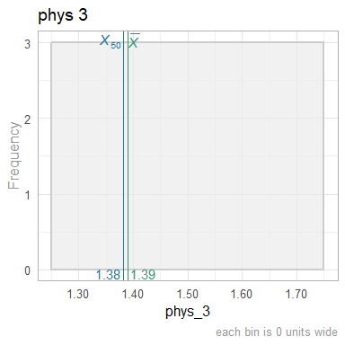
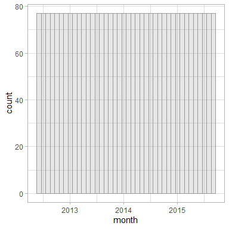

This report covers the analyses used in the ZZZ project (Marcus Mark, PI).

<!--  Set the working directory to the repository's base directory; this assumes the report is nested inside of two directories.-->


<!-- Set the report-wide options, and point to the external code file. -->


<!-- Load 'sourced' R files.  Suppress the output when loading sources. -->


<!-- Load packages, or at least verify they're available on the local machine.  Suppress the output when loading packages. -->


<!-- Load any global functions and variables declared in the R file.  Suppress the output. -->


<!-- Declare any global functions specific to a Rmd output.  Suppress the output. -->


<!-- Load the datasets.   -->


<!-- Tweak the datasets.   -->


Summary {.tabset .tabset-fade .tabset-pills}
===========================================================================

Notes
---------------------------------------------------------------------------

1. The current report covers 3080 county-months, with 77 unique values for `county_id`.
1. The Seattle track's phluguerstometer was producing flaky negative values; it's measurements have been dropped.


Unanswered Questions
---------------------------------------------------------------------------

1. What does `VS` stand for?  How was it measured?
1. Where the cars at the Philly track measured with the same phluguerstometer and the Cleveland track?


Answered Questions
---------------------------------------------------------------------------

1. The Seattle track's phluguerstometer was producing flaky negative values; it's measurements have been dropped.


Graphs
===========================================================================
Especially for the histograms, don't feel like each graph should be profound.
Boring sanity checks are useful,
such as the histogram of county names,
verifies there are ~77 different values (although they're mostly unreadable).


Marginals County
---------------------------------------------------------------------------

<!-- --><!-- --><!-- --><!-- --><!-- --><!-- --><!-- --><!-- --><!-- -->

Marginals County-Month
---------------------------------------------------------------------------

<!-- --><!-- --><!-- -->


Scatterplots
---------------------------------------------------------------------------

<!-- -->

```
NULL
```

```
$y
[1] "Sum of FTE for County"

$title
[1] "Zoomed: FTE sum each month (by county)"

attr(,"class")
[1] "labels"
```


Models
===========================================================================

Model Exploration
---------------------------------------------------------------------------

```
============= Simple model that's just an intercept. =============
```

```

Call:
lm(formula = fte ~ 1, data = ds_county_month)

Residuals:
    Min      1Q  Median      3Q     Max 
-1.6801 -1.6801 -0.6801  0.3199 24.8199 

Coefficients:
            Estimate Std. Error t value Pr(>|t|)
(Intercept)  1.68012    0.06074   27.66   <2e-16

Residual standard error: 3.371 on 3079 degrees of freedom
```

```
============= Model includes one predictor (ie, month). =============
```

```

Call:
lm(formula = fte ~ 1 + month, data = ds_county_month)

Residuals:
    Min      1Q  Median      3Q     Max 
-1.7997 -1.5990 -0.7322  0.2863 24.9208 

Coefficients:
              Estimate Std. Error t value Pr(>|t|)
(Intercept) -1.5619680  2.7859569  -0.561    0.575
month        0.0002014  0.0001730   1.164    0.245

Residual standard error: 3.371 on 3078 degrees of freedom
Multiple R-squared:  0.00044,	Adjusted R-squared:  0.0001153 
F-statistic: 1.355 on 1 and 3078 DF,  p-value: 0.2445
```

```
The one predictor is NOT significantly tighter.
```

```
Analysis of Variance Table

Model 1: fte ~ 1
Model 2: fte ~ 1 + month
  Res.Df   RSS Df Sum of Sq      F Pr(>F)
1   3079 34989                           
2   3078 34974  1    15.395 1.3549 0.2445
```

```
============= MLM for county. =============
```

```
Linear mixed model fit by REML ['lmerMod']
Formula: fte ~ 1 + (1 | county)
   Data: ds_county_month

REML criterion at convergence: 5210.2

Scaled residuals: 
    Min      1Q  Median      3Q     Max 
-5.9382 -0.6584 -0.0019  0.4365  9.6331 

Random effects:
 Groups   Name        Variance Std.Dev.
 county   (Intercept) 11.242   3.3530  
 Residual              0.264   0.5138  
Number of obs: 3080, groups:  county, 77

Fixed effects:
            Estimate Std. Error t value
(Intercept)   1.6801     0.3822   4.396
```

```
============= MLM adds month. =============
```

```
Linear mixed model fit by REML ['lmerMod']
Formula: fte ~ 1 + month + (1 | county)
   Data: ds_county_month

REML criterion at convergence: 5170.6

Scaled residuals: 
    Min      1Q  Median      3Q     Max 
-5.9782 -0.5621 -0.0094  0.4683  9.9245 

Random effects:
 Groups   Name        Variance Std.Dev.
 county   (Intercept) 11.2424  3.3530  
 Residual              0.2589  0.5088  
Number of obs: 3080, groups:  county, 77

Fixed effects:
              Estimate Std. Error t value
(Intercept) -1.562e+00  5.682e-01  -2.749
month        2.014e-04  2.612e-05   7.711

Correlation of Fixed Effects:
      (Intr)
month -0.740
```

```
Including the Month predictor in the MLM is significantly tighter.
```

```
Data: ds_county_month
Models:
m2: fte ~ 1 + (1 | county)
m3: fte ~ 1 + month + (1 | county)
   npar    AIC    BIC  logLik deviance  Chisq Df Pr(>Chisq)
m2    3 5216.1 5234.2 -2605.1   5210.1                     
m3    4 5159.2 5183.3 -2575.6   5151.2 58.899  1   1.66e-14
```


Final Model
---------------------------------------------------------------------------


|            | Estimate| Std. Error| t value|
|:-----------|--------:|----------:|-------:|
|(Intercept) |    -1.56|       0.57|   -2.75|
|month       |     0.00|       0.00|    7.71|

In the MLM that includes time, the slope coefficent of `month` is 2.013797\times 10^{-4}.


Session Information {#session-info}
===========================================================================

For the sake of documentation and reproducibility, the current report was rendered in the following environment.  Click the line below to expand.

<details>
  <summary>Environment <span class="glyphicon glyphicon-plus-sign"></span></summary>

```
─ Session info ───────────────────────────────────────────────────────────────────────────────────
 setting  value
 version  R version 4.2.2 Patched (2022-12-09 r83428 ucrt)
 os       Windows 10 x64 (build 22621)
 system   x86_64, mingw32
 ui       RStudio
 language (EN)
 collate  English_United States.utf8
 ctype    English_United States.utf8
 tz       America/Chicago
 date     2023-01-06
 rstudio  2022.12.0+353 Elsbeth Geranium (desktop)
 pandoc   2.19.2 @ C:/Program Files/RStudio/resources/app/bin/quarto/bin/tools/ (via rmarkdown)

─ Packages ───────────────────────────────────────────────────────────────────────────────────────
 ! package         * version     date (UTC) lib source
 D archive           1.1.5       2022-05-06 [1] CRAN (R 4.2.2)
   assertthat        0.2.1       2019-03-21 [1] CRAN (R 4.2.2)
   backports         1.4.1       2021-12-13 [1] CRAN (R 4.2.0)
   bit               4.0.5       2022-11-15 [1] CRAN (R 4.2.2)
   bit64             4.0.5       2020-08-30 [1] CRAN (R 4.2.2)
   blob              1.2.3       2022-04-10 [1] CRAN (R 4.2.2)
   boot              1.3-28.1    2022-11-22 [2] CRAN (R 4.2.2)
   broom             1.0.2       2022-12-15 [1] CRAN (R 4.2.2)
   bslib             0.4.2       2022-12-16 [1] CRAN (R 4.2.2)
   cachem            1.0.6       2021-08-19 [1] CRAN (R 4.2.2)
   callr             3.7.3       2022-11-02 [1] CRAN (R 4.2.2)
   checkmate         2.1.0       2022-04-21 [1] CRAN (R 4.2.2)
   cli               3.5.0       2022-12-20 [1] CRAN (R 4.2.2)
   colorspace        2.0-3       2022-02-21 [1] CRAN (R 4.2.2)
   config            0.3.1       2020-12-17 [1] CRAN (R 4.2.2)
   corrplot          0.92        2021-11-18 [1] CRAN (R 4.2.2)
   crayon            1.5.2       2022-09-29 [1] CRAN (R 4.2.2)
   crosstalk         1.2.0       2021-11-04 [1] CRAN (R 4.2.2)
   data.table        1.14.6      2022-11-16 [1] CRAN (R 4.2.2)
   DBI               1.1.3       2022-06-18 [1] CRAN (R 4.2.2)
   devtools          2.4.5       2022-10-11 [1] CRAN (R 4.2.2)
   digest            0.6.31      2022-12-11 [1] CRAN (R 4.2.2)
   dplyr             1.0.10      2022-09-01 [1] CRAN (R 4.2.2)
   DT                0.26        2022-10-19 [1] CRAN (R 4.2.2)
   ellipsis          0.3.2       2021-04-29 [1] CRAN (R 4.2.2)
   evaluate          0.19        2022-12-13 [1] CRAN (R 4.2.2)
   fansi             1.0.3       2022-03-24 [1] CRAN (R 4.2.2)
   farver            2.1.1       2022-07-06 [1] CRAN (R 4.2.2)
   fastmap           1.1.0       2021-01-25 [1] CRAN (R 4.2.2)
   flexdashboard   * 0.6.0       2022-08-05 [1] CRAN (R 4.2.2)
   forcats           0.5.2       2022-08-19 [1] CRAN (R 4.2.2)
   fs                1.5.2       2021-12-08 [1] CRAN (R 4.2.2)
   generics          0.1.3       2022-07-05 [1] CRAN (R 4.2.2)
   ggplot2         * 3.4.0       2022-11-04 [1] CRAN (R 4.2.2)
   glue              1.6.2       2022-02-24 [1] CRAN (R 4.2.2)
   gtable            0.3.1       2022-09-01 [1] CRAN (R 4.2.2)
   highr             0.10        2022-12-22 [1] CRAN (R 4.2.2)
   hms               1.1.2       2022-08-19 [1] CRAN (R 4.2.2)
   htmltools         0.5.4       2022-12-07 [1] CRAN (R 4.2.2)
   htmlwidgets       1.6.0       2022-12-15 [1] CRAN (R 4.2.2)
   httpuv            1.6.7       2022-12-14 [1] CRAN (R 4.2.2)
   httr              1.4.4       2022-08-17 [1] CRAN (R 4.2.2)
   import            1.3.0       2022-05-23 [1] CRAN (R 4.2.2)
   jquerylib         0.1.4       2021-04-26 [1] CRAN (R 4.2.2)
   jsonlite          1.8.4       2022-12-06 [1] CRAN (R 4.2.2)
   kableExtra        1.3.4       2021-02-20 [1] CRAN (R 4.2.2)
   knitr           * 1.41        2022-11-18 [1] CRAN (R 4.2.2)
   labeling          0.4.2       2020-10-20 [1] CRAN (R 4.2.0)
   later             1.3.0       2021-08-18 [1] CRAN (R 4.2.2)
   lattice           0.20-45     2021-09-22 [2] CRAN (R 4.2.2)
   lazyeval          0.2.2       2019-03-15 [1] CRAN (R 4.2.2)
   lifecycle         1.0.3       2022-10-07 [1] CRAN (R 4.2.2)
   lme4            * 1.1-31      2022-11-01 [1] CRAN (R 4.2.2)
   lubridate         1.9.0       2022-11-06 [1] CRAN (R 4.2.2)
   magrittr          2.0.3       2022-03-30 [1] CRAN (R 4.2.2)
   MASS              7.3-58.1    2022-08-03 [2] CRAN (R 4.2.2)
   Matrix          * 1.5-3       2022-11-11 [2] CRAN (R 4.2.2)
   memoise           2.0.1       2021-11-26 [1] CRAN (R 4.2.2)
   mgcv              1.8-41      2022-10-21 [2] CRAN (R 4.2.2)
   mime              0.12        2021-09-28 [1] CRAN (R 4.2.0)
   miniUI            0.1.1.1     2018-05-18 [1] CRAN (R 4.2.2)
   minqa             1.2.5       2022-10-19 [1] CRAN (R 4.2.2)
   munsell           0.5.0       2018-06-12 [1] CRAN (R 4.2.2)
   nlme              3.1-160     2022-10-10 [2] CRAN (R 4.2.2)
   nloptr            2.0.3       2022-05-26 [1] CRAN (R 4.2.2)
   odbc              1.3.3       2021-11-30 [1] CRAN (R 4.2.2)
   OuhscMunge        0.2.0.9015  2022-12-11 [1] Github (OuhscBbmc/OuhscMunge@4e04b6f)
   pillar            1.8.1       2022-08-19 [1] CRAN (R 4.2.2)
   pkgbuild          1.4.0       2022-11-27 [1] CRAN (R 4.2.2)
   pkgconfig         2.0.3       2019-09-22 [1] CRAN (R 4.2.2)
   pkgload           1.3.2       2022-11-16 [1] CRAN (R 4.2.2)
   plotly          * 4.10.1      2022-11-07 [1] CRAN (R 4.2.2)
   prettyunits       1.1.1       2020-01-24 [1] CRAN (R 4.2.2)
   processx          3.8.0       2022-10-26 [1] CRAN (R 4.2.2)
   profvis           0.3.7       2020-11-02 [1] CRAN (R 4.2.2)
   promises          1.2.0.1     2021-02-11 [1] CRAN (R 4.2.2)
   ps                1.7.2       2022-10-26 [1] CRAN (R 4.2.2)
   purrr             1.0.0       2022-12-20 [1] CRAN (R 4.2.2)
   R6                2.5.1       2021-08-19 [1] CRAN (R 4.2.2)
   RColorBrewer      1.1-3       2022-04-03 [1] CRAN (R 4.2.0)
   Rcpp              1.0.9       2022-07-08 [1] CRAN (R 4.2.2)
   readr             2.1.3       2022-10-01 [1] CRAN (R 4.2.2)
   remotes           2.4.2       2021-11-30 [1] CRAN (R 4.2.2)
   rlang             1.0.6       2022-09-24 [1] CRAN (R 4.2.2)
   rmarkdown         2.19        2022-12-15 [1] CRAN (R 4.2.2)
   RSQLite           2.2.20      2022-12-22 [1] CRAN (R 4.2.2)
   rstudioapi        0.14        2022-08-22 [1] CRAN (R 4.2.2)
   rvest             1.0.3       2022-08-19 [1] CRAN (R 4.2.2)
   sass              0.4.4       2022-11-24 [1] CRAN (R 4.2.2)
   scales            1.2.1       2022-08-20 [1] CRAN (R 4.2.2)
   sessioninfo       1.2.2       2021-12-06 [1] CRAN (R 4.2.2)
   shiny             1.7.4       2022-12-15 [1] CRAN (R 4.2.2)
   stringi           1.7.8       2022-07-11 [1] CRAN (R 4.2.1)
   stringr           1.5.0       2022-12-02 [1] CRAN (R 4.2.2)
   svglite           2.1.0       2022-02-03 [1] CRAN (R 4.2.2)
   systemfonts       1.0.4       2022-02-11 [1] CRAN (R 4.2.2)
   TabularManifest   0.1-16.9003 2022-12-11 [1] Github (Melinae/TabularManifest@b966a2b)
   testit            0.13        2021-04-14 [1] CRAN (R 4.2.2)
   tibble            3.1.8       2022-07-22 [1] CRAN (R 4.2.2)
   tidyr             1.2.1       2022-09-08 [1] CRAN (R 4.2.2)
   tidyselect        1.2.0       2022-10-10 [1] CRAN (R 4.2.2)
   timechange        0.1.1       2022-11-04 [1] CRAN (R 4.2.2)
   tzdb              0.3.0       2022-03-28 [1] CRAN (R 4.2.2)
   urlchecker        1.0.1       2021-11-30 [1] CRAN (R 4.2.2)
   usethis           2.1.6       2022-05-25 [1] CRAN (R 4.2.2)
   utf8              1.2.2       2021-07-24 [1] CRAN (R 4.2.2)
   vctrs             0.5.1       2022-11-16 [1] CRAN (R 4.2.2)
   viridisLite       0.4.1       2022-08-22 [1] CRAN (R 4.2.2)
   vroom             1.6.0       2022-09-30 [1] CRAN (R 4.2.2)
   webshot           0.5.4       2022-09-26 [1] CRAN (R 4.2.2)
   withr             2.5.0       2022-03-03 [1] CRAN (R 4.2.2)
   xfun              0.36        2022-12-21 [1] CRAN (R 4.2.2)
   xml2              1.3.3       2021-11-30 [1] CRAN (R 4.2.2)
   xtable            1.8-4       2019-04-21 [1] CRAN (R 4.2.2)
   yaml              2.3.6       2022-10-18 [1] CRAN (R 4.2.2)
   zoo               1.8-11      2022-09-17 [1] CRAN (R 4.2.2)

 [1] C:/Users/wibea/AppData/Local/R/win-library/4.2
 [2] C:/Program Files/R/R-4.2.2patched/library

 D ── DLL MD5 mismatch, broken installation.

──────────────────────────────────────────────────────────────────────────────────────────────────
```
</details>


Report rendered by wibea at 2023-01-06, 10:51 -0600 in 3 seconds.
