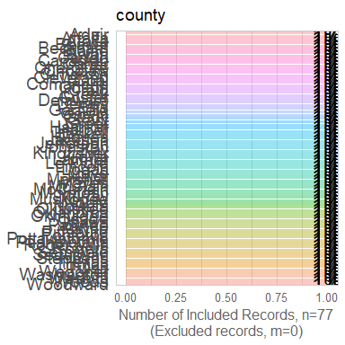
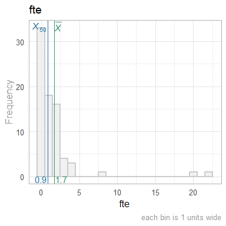
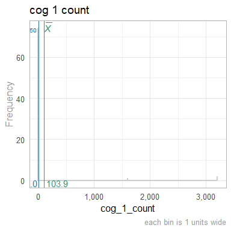
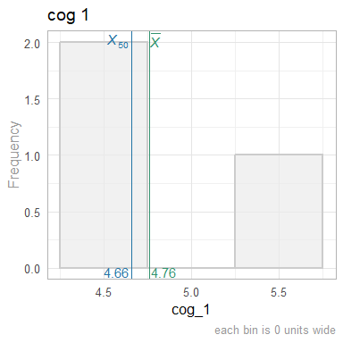
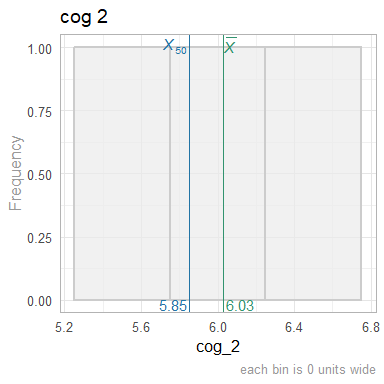
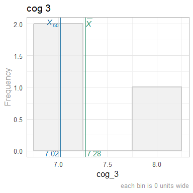
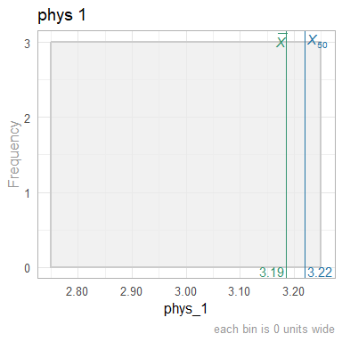
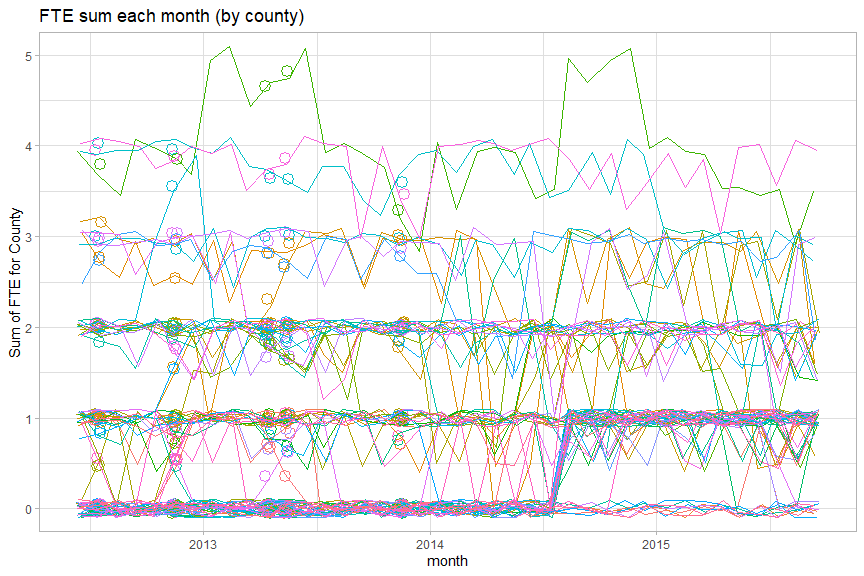

This report covers the analyses used in the ZZZ project (Marcus Mark, PI).

<!--  Set the working directory to the repository's base directory; this assumes the report is nested inside of two directories.-->


<!-- Set the report-wide options, and point to the external code file. -->


<!-- Load 'sourced' R files.  Suppress the output when loading sources. -->


<!-- Load packages, or at least verify they're available on the local machine.  Suppress the output when loading packages. -->


<!-- Load any global functions and variables declared in the R file.  Suppress the output. -->


<!-- Declare any global functions specific to a Rmd output.  Suppress the output. -->


<!-- Load the datasets.   -->


<!-- Tweak the datasets.   -->


Summary {.tabset .tabset-fade .tabset-pills}
===========================================================================

Notes
---------------------------------------------------------------------------

1. The current report covers 3080 county-months, with 77 unique values for `county_id`.
1. The Seattle track's phluguerstometer was producing flaky negative values; it's measurements have been dropped.


Unanswered Questions
---------------------------------------------------------------------------

1. What does `VS` stand for?  How was it measured?
1. Where the cars at the Philly track measured with the same phluguerstometer and the Cleveland track?


Answered Questions
---------------------------------------------------------------------------

1. The Seattle track's phluguerstometer was producing flaky negative values; it's measurements have been dropped.


Graphs
===========================================================================
Especially for the histograms, don't feel like each graph should be profound.
Boring sanity checks are useful,
such as the histogram of county names,
verifies there are ~77 different values (although they're mostly unreadable).


Marginals County
---------------------------------------------------------------------------



Marginals County-Month
---------------------------------------------------------------------------


Scatterplots
---------------------------------------------------------------------------



```
$y
[1] "Sum of FTE for County"

$title
[1] "Zoomed: FTE sum each month (by county)"

attr(,"class")
[1] "labels"
```


Models
===========================================================================

Model Exploration
---------------------------------------------------------------------------

```
============= Simple model that's just an intercept. =============
```

```

Call:
lm(formula = fte ~ 1, data = ds_county_month)

Residuals:
    Min      1Q  Median      3Q     Max 
-1.6801 -1.6801 -0.6801  0.3199 24.8199 

Coefficients:
            Estimate Std. Error t value Pr(>|t|)
(Intercept)  1.68012    0.06074   27.66   <2e-16

Residual standard error: 3.371 on 3079 degrees of freedom
```

```
============= Model includes one predictor (ie, month). =============
```

```

Call:
lm(formula = fte ~ 1 + month, data = ds_county_month)

Residuals:
    Min      1Q  Median      3Q     Max 
-1.7997 -1.5990 -0.7322  0.2863 24.9208 

Coefficients:
              Estimate Std. Error t value Pr(>|t|)
(Intercept) -1.5619680  2.7859569  -0.561    0.575
month        0.0002014  0.0001730   1.164    0.245

Residual standard error: 3.371 on 3078 degrees of freedom
Multiple R-squared:  0.00044,	Adjusted R-squared:  0.0001153 
F-statistic: 1.355 on 1 and 3078 DF,  p-value: 0.2445
```

```
The one predictor is NOT significantly tighter.
```

```
Analysis of Variance Table

Model 1: fte ~ 1
Model 2: fte ~ 1 + month
  Res.Df   RSS Df Sum of Sq      F Pr(>F)
1   3079 34989                           
2   3078 34974  1    15.395 1.3549 0.2445
```

```
============= MLM for county. =============
```

```
Linear mixed model fit by REML ['lmerMod']
Formula: fte ~ 1 + (1 | county)
   Data: ds_county_month

REML criterion at convergence: 5210.2

Scaled residuals: 
    Min      1Q  Median      3Q     Max 
-5.9382 -0.6584 -0.0019  0.4365  9.6331 

Random effects:
 Groups   Name        Variance Std.Dev.
 county   (Intercept) 11.242   3.3530  
 Residual              0.264   0.5138  
Number of obs: 3080, groups:  county, 77

Fixed effects:
            Estimate Std. Error t value
(Intercept)   1.6801     0.3822   4.396
```

```
============= MLM adds month. =============
```

```
Linear mixed model fit by REML ['lmerMod']
Formula: fte ~ 1 + month + (1 | county)
   Data: ds_county_month

REML criterion at convergence: 5170.6

Scaled residuals: 
    Min      1Q  Median      3Q     Max 
-5.9782 -0.5621 -0.0094  0.4683  9.9245 

Random effects:
 Groups   Name        Variance Std.Dev.
 county   (Intercept) 11.2424  3.3530  
 Residual              0.2589  0.5088  
Number of obs: 3080, groups:  county, 77

Fixed effects:
              Estimate Std. Error t value
(Intercept) -1.562e+00  5.682e-01  -2.749
month        2.014e-04  2.612e-05   7.711

Correlation of Fixed Effects:
      (Intr)
month -0.740
```

```
Including the Month predictor in the MLM is significantly tighter.
```

```
Data: ds_county_month
Models:
m2: fte ~ 1 + (1 | county)
m3: fte ~ 1 + month + (1 | county)
   Df    AIC    BIC  logLik deviance  Chisq Chi Df Pr(>Chisq)
m2  3 5216.1 5234.2 -2605.1   5210.1                         
m3  4 5159.2 5183.3 -2575.6   5151.2 58.899      1   1.66e-14
```


Final Model
---------------------------------------------------------------------------


|            | Estimate| Std. Error| t value|
|:-----------|--------:|----------:|-------:|
|(Intercept) |    -1.56|       0.57|   -2.75|
|month       |     0.00|       0.00|    7.71|

In the MLM that includes time, the slope coefficent of `month` is 2.013797\times 10^{-4}.


Session Information {#session-info}
===========================================================================

For the sake of documentation and reproducibility, the current report was rendered in the following environment.  Click the line below to expand.

<details>
  <summary>Environment <span class="glyphicon glyphicon-plus-sign"></span></summary>

```
─ Session info ──────────────────────────────────────────────────────────
 setting  value                       
 version  R version 3.5.2 (2018-12-20)
 os       Ubuntu 18.04.2 LTS          
 system   x86_64, linux-gnu           
 ui       RStudio                     
 language (EN)                        
 collate  en_US.UTF-8                 
 ctype    en_US.UTF-8                 
 tz       America/Chicago             
 date     2019-02-27                  

─ Packages ──────────────────────────────────────────────────────────────
 package         * version     date       lib
 assertthat        0.2.0       2017-04-11 [1]
 backports         1.1.3       2018-12-14 [1]
 bit               1.1-14      2018-05-29 [1]
 bit64             0.9-7       2017-05-08 [1]
 blob              1.1.1       2018-03-25 [1]
 callr             3.1.1       2018-12-21 [1]
 checkmate         1.9.1       2019-01-15 [1]
 cli               1.0.1       2018-09-25 [1]
 colorspace        1.4-0       2019-01-13 [1]
 config            0.3         2018-03-27 [1]
 crayon            1.3.4       2017-09-16 [1]
 DBI               1.0.0       2018-05-02 [1]
 desc              1.2.0       2018-05-01 [1]
 devtools          2.0.1       2018-10-26 [1]
 digest            0.6.18      2018-10-10 [1]
 dplyr             0.8.0.1     2019-02-15 [1]
 evaluate          0.13        2019-02-12 [1]
 fs                1.2.6       2018-08-23 [1]
 ggplot2         * 3.1.0       2018-10-25 [1]
 glue              1.3.0       2018-07-17 [1]
 gtable            0.2.0       2016-02-26 [1]
 highr             0.7         2018-06-09 [1]
 hms               0.4.2.9001  2018-08-18 [1]
 htmltools         0.3.6       2017-04-28 [1]
 knitr           * 1.21        2018-12-10 [1]
 labeling          0.3         2014-08-23 [1]
 lattice           0.20-38     2018-11-04 [4]
 lazyeval          0.2.1       2017-10-29 [1]
 lme4            * 1.1-20      2019-02-04 [1]
 lubridate         1.7.4       2018-04-11 [1]
 magrittr        * 1.5         2014-11-22 [1]
 MASS              7.3-51.1    2018-11-01 [4]
 Matrix          * 1.2-15      2018-11-01 [4]
 memoise           1.1.0       2017-04-21 [1]
 minqa             1.2.4       2014-10-09 [1]
 munsell           0.5.0       2018-06-12 [1]
 nlme              3.1-137     2018-04-07 [4]
 nloptr            1.2.1       2018-10-03 [1]
 odbc              1.1.6       2018-06-09 [1]
 OuhscMunge        0.1.9.9010  2019-02-28 [1]
 packrat           0.5.0       2018-11-14 [1]
 pillar            1.3.1       2018-12-15 [1]
 pkgbuild          1.0.2       2018-10-16 [1]
 pkgconfig         2.0.2       2018-08-16 [1]
 pkgload           1.0.2       2018-10-29 [1]
 plyr              1.8.4       2016-06-08 [1]
 prettyunits       1.0.2       2015-07-13 [1]
 processx          3.2.1       2018-12-05 [1]
 ps                1.3.0       2018-12-21 [1]
 purrr             0.3.0       2019-01-27 [1]
 R6                2.4.0       2019-02-14 [1]
 Rcpp              1.0.0       2018-11-07 [1]
 RcppRoll          0.3.0       2018-06-05 [1]
 readr             1.3.1       2018-12-21 [1]
 remotes           2.0.2       2018-10-30 [1]
 rlang             0.3.1       2019-01-08 [1]
 rmarkdown         1.11        2018-12-08 [1]
 rprojroot         1.3-2       2018-01-03 [1]
 RSQLite           2.1.1       2018-05-06 [1]
 scales            1.0.0.9000  2019-01-11 [1]
 sessioninfo       1.1.1       2018-11-05 [1]
 stringi           1.3.1       2019-02-13 [1]
 stringr           1.4.0       2019-02-10 [1]
 TabularManifest   0.1-16.9003 2019-01-31 [1]
 testit            0.9         2018-12-05 [1]
 testthat          2.0.1       2018-10-13 [1]
 tibble            2.0.1       2019-01-12 [1]
 tidyr             0.8.2       2018-10-28 [1]
 tidyselect        0.2.5       2018-10-11 [1]
 usethis           1.4.0       2018-08-14 [1]
 viridisLite       0.3.0       2018-02-01 [1]
 withr             2.1.2       2018-03-15 [1]
 xfun              0.5         2019-02-20 [1]
 yaml              2.2.0       2018-07-25 [1]
 zoo               1.8-4       2018-09-19 [1]
 source                        
 CRAN (R 3.5.1)                
 CRAN (R 3.5.2)                
 CRAN (R 3.5.1)                
 CRAN (R 3.5.1)                
 CRAN (R 3.5.1)                
 CRAN (R 3.5.2)                
 CRAN (R 3.5.2)                
 CRAN (R 3.5.1)                
 CRAN (R 3.5.2)                
 CRAN (R 3.5.1)                
 CRAN (R 3.5.1)                
 CRAN (R 3.5.1)                
 CRAN (R 3.5.1)                
 CRAN (R 3.5.1)                
 CRAN (R 3.5.1)                
 CRAN (R 3.5.2)                
 CRAN (R 3.5.2)                
 CRAN (R 3.5.1)                
 CRAN (R 3.5.1)                
 CRAN (R 3.5.1)                
 CRAN (R 3.5.1)                
 CRAN (R 3.5.1)                
 Github (tidyverse/hms@979286f)
 CRAN (R 3.5.1)                
 CRAN (R 3.5.1)                
 CRAN (R 3.5.1)                
 CRAN (R 3.5.1)                
 CRAN (R 3.5.1)                
 CRAN (R 3.5.2)                
 CRAN (R 3.5.1)                
 CRAN (R 3.5.1)                
 CRAN (R 3.5.1)                
 CRAN (R 3.5.1)                
 CRAN (R 3.5.1)                
 CRAN (R 3.5.1)                
 CRAN (R 3.5.1)                
 CRAN (R 3.5.0)                
 CRAN (R 3.5.1)                
 CRAN (R 3.5.1)                
 local                         
 CRAN (R 3.5.1)                
 CRAN (R 3.5.2)                
 CRAN (R 3.5.1)                
 CRAN (R 3.5.1)                
 CRAN (R 3.5.1)                
 CRAN (R 3.5.1)                
 CRAN (R 3.5.1)                
 CRAN (R 3.5.1)                
 CRAN (R 3.5.2)                
 CRAN (R 3.5.2)                
 CRAN (R 3.5.2)                
 CRAN (R 3.5.1)                
 CRAN (R 3.5.1)                
 CRAN (R 3.5.2)                
 CRAN (R 3.5.1)                
 CRAN (R 3.5.2)                
 CRAN (R 3.5.1)                
 CRAN (R 3.5.1)                
 CRAN (R 3.5.1)                
 local                         
 CRAN (R 3.5.1)                
 CRAN (R 3.5.2)                
 CRAN (R 3.5.2)                
 local                         
 CRAN (R 3.5.1)                
 CRAN (R 3.5.1)                
 CRAN (R 3.5.2)                
 CRAN (R 3.5.1)                
 CRAN (R 3.5.1)                
 CRAN (R 3.5.1)                
 CRAN (R 3.5.1)                
 CRAN (R 3.5.1)                
 CRAN (R 3.5.2)                
 CRAN (R 3.5.1)                
 CRAN (R 3.5.1)                

[1] /home/wibeasley/R/x86_64-pc-linux-gnu-library/3.5
[2] /usr/local/lib/R/site-library
[3] /usr/lib/R/site-library
[4] /usr/lib/R/library
```
</details>


Report rendered by wibeasley at 2019-02-27, 21:16 -0600 in 15 seconds.
