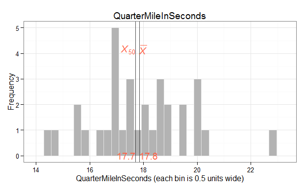
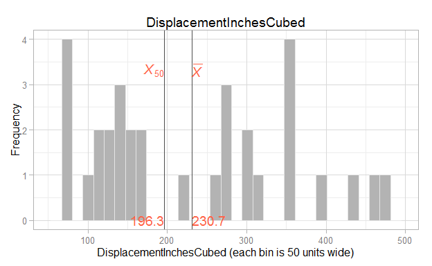
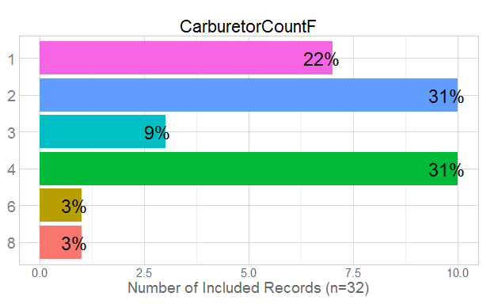
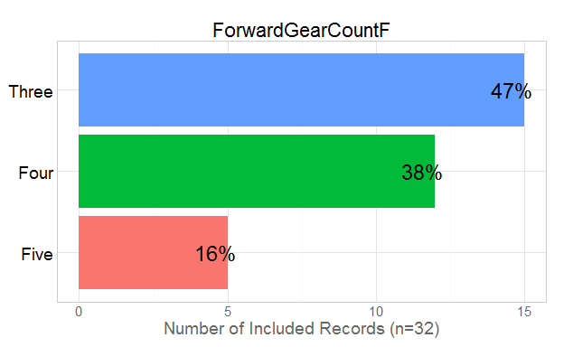
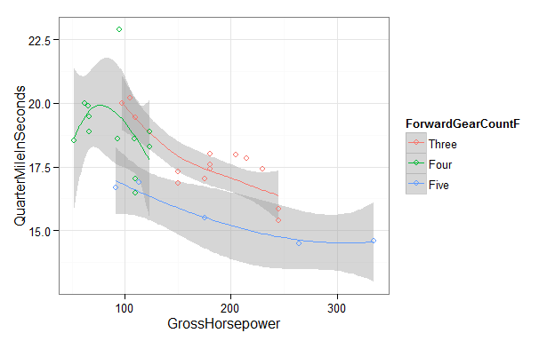
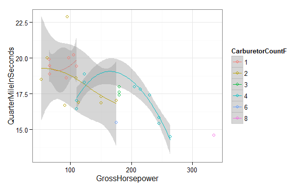
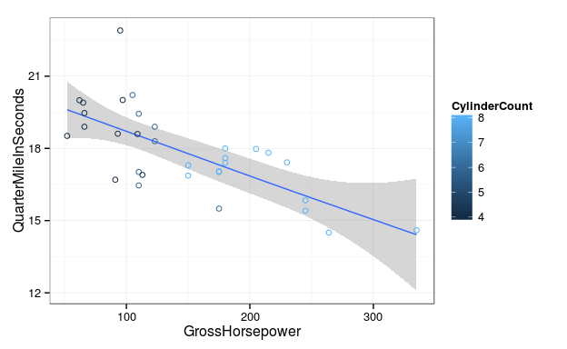
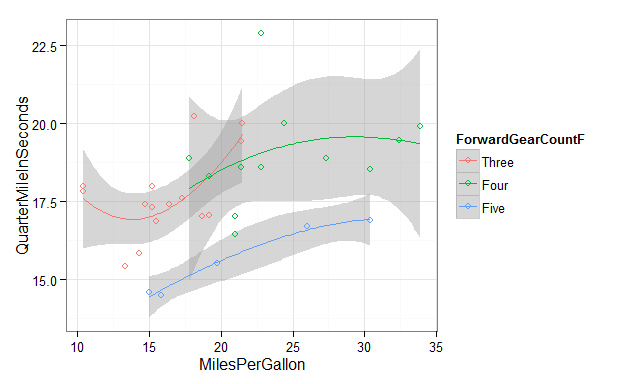
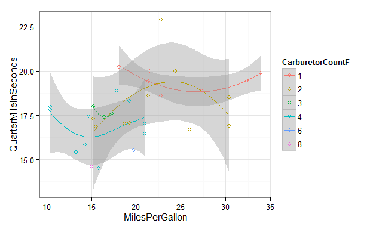
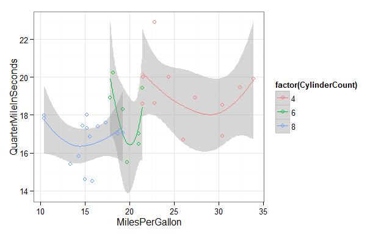

# Skeleton Report 1

This report covers the analyses used in the ZZZ project (Marcus Mark, PI).

<!--  Set the working directory to the repository's base directory; this assumes the report is nested inside of two directories.-->


<!-- Set the report-wide options, and point to the external code file. -->


<!-- Load the sources.  Suppress the output when loading sources. --> 


<!-- Load 'sourced' R files.  Suppress the output when loading packages. --> 


<!-- Load any global functions and variables declared in the R file.  Suppress the output. --> 


<!-- Declare any global functions specific to a Rmd output.  Suppress the output. --> 


<!-- Load the datasets.   -->


<!-- Tweak the datasets.   -->


## Notes

**Note 1**: The current report covers 32 cars, with 6 possible values for `CarburetorCount`.

**Note 2**: The Seattle track's phluguerstometer was producing flaky negative values; it's measurements have been dropped.

# Marginals
    

# Scatterplots
     

```
Warning in simpleLoess(y, x, w, span, degree, parametric, drop.square, normalize, : span too small. fewer data values
than degrees of freedom.
```

```
Warning in simpleLoess(y, x, w, span, degree, parametric, drop.square, normalize, : Chernobyl! trL>n 3
```

```
Warning in simpleLoess(y, x, w, span, degree, parametric, drop.square, normalize, : Chernobyl! trL>n 3
```

```
Warning in predLoess(y, x, newx, s, weights, pars$robust, pars$span, pars$degree, : span too small. fewer data values
than degrees of freedom.
```

```
Warning in qt(level/2 + 0.5, pred$df): NaNs produced
```

  

# Models

```
============= Simple model that's just an intercept. =============
```

```

Call:
lm(formula = QuarterMileInSeconds ~ 1, data = ds)

Residuals:
    Min      1Q  Median      3Q     Max 
-3.3487 -0.9562 -0.1387  1.0512  5.0512 

Coefficients:
            Estimate Std. Error t value Pr(>|t|)
(Intercept)  17.8487     0.3159    56.5   <2e-16

Residual standard error: 1.787 on 31 degrees of freedom
```

```
============= Model includes one predictor. =============
```

```

Call:
lm(formula = QuarterMileInSeconds ~ 1 + MilesPerGallon, data = ds)

Residuals:
    Min      1Q  Median      3Q     Max 
-2.8161 -1.0287  0.0954  0.8623  4.7149 

Coefficients:
               Estimate Std. Error t value Pr(>|t|)
(Intercept)    15.35477    1.02978  14.911 2.05e-15
MilesPerGallon  0.12414    0.04916   2.525   0.0171

Residual standard error: 1.65 on 30 degrees of freedom
Multiple R-squared:  0.1753,	Adjusted R-squared:  0.1478 
F-statistic: 6.377 on 1 and 30 DF,  p-value: 0.01708
```

```
The one predictor is significantly tighter.
```

```
Analysis of Variance Table

Model 1: QuarterMileInSeconds ~ 1
Model 2: QuarterMileInSeconds ~ 1 + MilesPerGallon
  Res.Df    RSS Df Sum of Sq      F  Pr(>F)
1     31 98.988                            
2     30 81.636  1    17.352 6.3767 0.01708
```

```
============= Model includes two predictors. =============
```

```

Call:
lm(formula = QuarterMileInSeconds ~ 1 + MilesPerGallon + ForwardGearCountF, 
    data = ds)

Residuals:
    Min      1Q  Median      3Q     Max 
-2.0370 -0.5882 -0.1602  0.5428  4.1646 

Coefficients:
                      Estimate Std. Error t value Pr(>|t|)
(Intercept)           15.55851    0.89782  17.329  < 2e-16
MilesPerGallon         0.13246    0.05164   2.565 0.015963
ForwardGearCountFFour  0.15680    0.66819   0.235 0.816173
ForwardGearCountFFive -2.75051    0.72888  -3.774 0.000768

Residual standard error: 1.309 on 28 degrees of freedom
Multiple R-squared:  0.5151,	Adjusted R-squared:  0.4632 
F-statistic: 9.916 on 3 and 28 DF,  p-value: 0.0001272
```

```
The two predictor is significantly tighter.
```

```
Analysis of Variance Table

Model 1: QuarterMileInSeconds ~ 1 + MilesPerGallon
Model 2: QuarterMileInSeconds ~ 1 + MilesPerGallon + ForwardGearCountF
  Res.Df    RSS Df Sum of Sq      F    Pr(>F)
1     30 81.636                              
2     28 47.996  2     33.64 9.8124 0.0005896
```

# Questions
## Unanswered Questions
 1. What does `VS` stand for?  How was it measured?
 1. Where the cars at the Philly track measured with the same phluguerstometer and the Cleveland track?
 
## Answered Questions
 1. The Seattle track's phluguerstometer was producing flaky negative values; it's measurements have been dropped.

# Session Information
For the sake of documentation and reproducibility, the current report was rendered on a system using the following software.


```
Report rendered by Will at 2015-10-07, 16:49 -0500
```

```
R version 3.2.2 Patched (2015-09-18 r69405)
Platform: x86_64-w64-mingw32/x64 (64-bit)
Running under: Windows >= 8 x64 (build 9200)

locale:
[1] LC_COLLATE=English_United States.1252  LC_CTYPE=English_United States.1252    LC_MONETARY=English_United States.1252
[4] LC_NUMERIC=C                           LC_TIME=English_United States.1252    

attached base packages:
[1] stats     graphics  grDevices utils     datasets  methods   base     

other attached packages:
[1] ggplot2_1.0.1      RColorBrewer_1.1-2 scales_0.3.0       knitr_1.11        

loaded via a namespace (and not attached):
 [1] Rcpp_0.12.1      digest_0.6.8     MASS_7.3-44      grid_3.2.2       plyr_1.8.3       gtable_0.1.2    
 [7] formatR_1.2.1    magrittr_1.5     evaluate_0.8     stringi_0.5-5    reshape2_1.4.1   rmarkdown_0.8   
[13] labeling_0.3     proto_0.3-10     tools_3.2.2      stringr_1.0.0    munsell_0.4.2    yaml_2.1.13     
[19] colorspace_1.2-6 htmltools_0.2.6 
```
